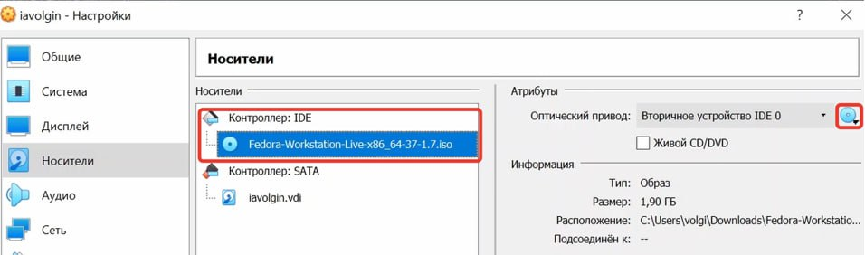

---
## Front matter
lang: ru-RU
title: Лаботраторная работа №1
subtitle: Операционные системы
author:
  - Волгин И. А.
institute:
  - Российский университет дружбы народов, Москва, Россия
date: 19 декабря 2023

## i18n babel
babel-lang: russian
babel-otherlangs: english

## Formatting pdf
toc: false
toc-title: Содержание
slide_level: 2
aspectratio: 169
section-titles: true
theme: metropolis
header-includes:
 - \metroset{progressbar=frametitle,sectionpage=progressbar,numbering=fraction}
 - '\makeatletter'
 - '\beamer@ignorenonframefalse'
 - '\makeatother'
---

## Цель работы

Целью данной работы является приобретение практических навыков установки операционной системы на виртуальную машину, настройки минимально необходимых для дальнейшей работы сервисов.

## Задание

1. Создание виртуальной машины.
2. Установка операционной системы.
3. Работа с операционной системой после установки.
4. Установка программного обеспечения для создания документации.
5. Дополнительные задания.

## Создание виртуальной машины

Для начала надо скачать iso-образ дистрибутива Линукс и программу VirtualBox. Далее в ней нужно создать виртуальную машину и заполнить информацию: имя, тип и версию.

{#fig:001 width=70%}

## Первичная настройка виртуальной машины

Далее нужно указать некоторые характеристики машины: оперативная память (8Гб), жесткий диск (виртуальный), виртуальный жесткий диск (динамический), его размер (100Гб). Виртуальная машина создана.
После этого мы продолжаем ее настройку. Заходим во вкладку под названием «настройки». Там выделяем 3 ядра процессора для машины, максимальную видеопамять, а так же во вкладке «носители» пункте «контроллер: IDE» нажимаем на диск и выбираем iso-образ нашего дистрибутива.

{#fig:002 width=49%}
{#fig:003 width=49%}

## Настройка системы

Далее нажимаем кнопку «установить» и начинается загрузка. После того, как виртуальная машина загрузилась, нам нужно ее выключить и изъять образ дистрибутива из привода.
Затем мы запускаем виртуальную машину и начинаем ее настройку. Нам нужно будет создать пользователя – указать имя и задать пароль.

{#fig:005 width=49%}
{#fig:006 width=49%}

## Первые необходимые команды в терминале

После этого открываем терминал, переключаемся на роль супер-пользователя (sudo -i) и обновляем все пакеты (dnf -y update).
Также устанавливаем mc (dnf install tmux mc).

{#fig:007 width=49%}
{#fig:008 width=49%}

## Изменяем некоторые параметры в системе с помощью mc

Отключаем систему безопасности SELinux. Для этого с помощью mc заходим в файл /etc/selinux/config. Там меняем значение SELINUX с enforcing на permissive и перезагружаем виртуальную машину.
После этого меняем раскладку клавиатуры тоже с помощью mc. Нужно отредактировать конфигурационный файл /etc/X11/xorg.conf.d/00-keyboard.conf и снова виртуальную перезапустить машину.

{#fig:009 width=49%}
{#fig:010 width=49%}

## Установка TexLive и pandoc

Далее устанавливаем дополнительное программное обеспечение. Скачиваем с сайта texlive архив и распаковываем его.
Далее запускаем скрипт install-tl-* с root правами, и texlive установлен. 
После этого устанавливаем pandoc и pandoc-crossref. Нужно зайти на github на страницу для скачивания и найти номер последней версии pandoc и соответствующую ему версию pandoc-crossref. Скачиваем архивы с ними через терминал. После этого распаковываем архивы и переносим их в файл /usr/local/bin. Pandoc установлен.

{#fig:011 width=49%}
{#fig:012 width=49%}

## Домашнее задание №1-2

Анализируем последовательность загрузки системы и ищем версию ядра линукс. 

{#fig:013 width=49%}
{#fig:014 width=49%}

## Домашнее задание №3-4

Частота(processor) и модель(CPU0) процессора.

{#fig:015 width=49%}
{#fig:016 width=49%}

## Домашнее задание №5-6

Объем доступной оперативной памяти (Memory) и тип обнаруженного гипервизора (Hypervisor detected).

{#fig:017 width=49%}
{#fig:018 width=49%}

## Домашнее задание №7-8

Тип файловой системы корневого каталога (sda3) и последовательность монтирования файловых систем (Mounted).

{#fig:019 width=49%}
{#fig:020 width=49%}

## Вывод

В ходе выполнения лабораторной работы я получил практические навыки установки операционной системы на виртуальную машину, настройки минимально необходимых для дальнейшей работы сервисов.

## Контрольные вопросы №1-2

1. Какую информацию содержит учетная запись пользователя?
-Она содержит User ID - логин, Password – наличие пароля, UID – идентификатор пользователя, User info – вспомогательная информация (полное имя, контактные данные), Home dir – начальный каталог.
2. Укажите команды терминала и приведите примеры:
    • Для получения справки по команде ( <команда> --help, пример – cat –h)
    • Для перемещения по файловой системе ( mv, пример – mv <что хотим перенести> <куда хотим перенести>)
    • Для просмотра содержимого каталога (ls, пример – ls ~/etc)
    • Для определения объема каталога ( sudo du, пример – sudo du <параметры> < путь к каталогу>)
    • Для создания/удаления файлов ( mkdir/rm, пример – mkdir fail, rm fail)
    • Для создания определенный прав на файл каталог ( chmod, пример chmod <опции> <категория, действие> < файл>
    • Для просмотра истории команд (history)
    
## Контрольные вопросы №3-5

3. Что такое файловая система? Приведите примеры с краткой характеристикой.
Файловая система это встроенный уровень операционной системы Linux, используемый для управления данными хранилища.
4. Как посмотреть, какие файловые системы подмонтированы в ОС?
Это можно сделать с помощью команды findmnt
5. Как удалить зависший процесс?
 Ctrl + C

:::

