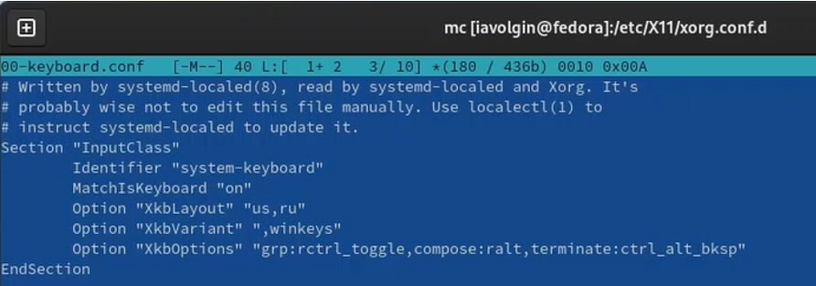

---
## Front matter
title: "Отчет по лабораторная работа №1"
subtitle: "Дисциплина - операционные системы"
author: "Волгин Иван Алексеевич"

## Generic otions
lang: ru-RU
toc-title: "Содержание"

## Bibliography
bibliography: bib/cite.bib
csl: pandoc/csl/gost-r-7-0-5-2008-numeric.csl

## Pdf output format
toc: true # Table of contents
toc-depth: 2
lof: true # List of figures
lot: true # List of tables
fontsize: 12pt
linestretch: 1.5
papersize: a4
documentclass: scrreprt
## I18n polyglossia
polyglossia-lang:
  name: russian
  options:
	- spelling=modern
	- babelshorthands=true
polyglossia-otherlangs:
  name: english
## I18n babel
babel-lang: russian
babel-otherlangs: english
## Fonts
mainfont: PT Serif
romanfont: PT Serif
sansfont: PT Sans
monofont: PT Mono
mainfontoptions: Ligatures=TeX
romanfontoptions: Ligatures=TeX
sansfontoptions: Ligatures=TeX,Scale=MatchLowercase
monofontoptions: Scale=MatchLowercase,Scale=0.9
## Biblatex
biblatex: true
biblio-style: "gost-numeric"
biblatexoptions:
  - parentracker=true
  - backend=biber
  - hyperref=auto
  - language=auto
  - autolang=other*
  - citestyle=gost-numeric
## Pandoc-crossref LaTeX customization
figureTitle: "Рис."
tableTitle: "Таблица"
listingTitle: "Листинг"
lofTitle: "Список иллюстраций"
lotTitle: "Список таблиц"
lolTitle: "Листинги"
## Misc options
indent: true
header-includes:
  - \usepackage{indentfirst}
  - \usepackage{float} # keep figures where there are in the text
  - \floatplacement{figure}{H} # keep figures where there are in the text
---

# Цель работы

Целью данной работы является приобретение практических навыков установки операционной системы на виртуальную машину, настройки минимально необходимых для дальнейшей работы сервисов.

# Задание

1. Создание виртуальной машины.
2. Установка операционной системы.
3. Работа с операционной системой после установки.
4. Установка программного обеспечения для создания документации.
5. Дополнительные задания.

# Выполнение лабораторной работы

1. Для начала надо скачать iso-образ дистрибутива Линукс и программу VirtualBox. Далее в ней нужно создать виртуальную машину и заполнить информацию: имя, тип и версию (рис. fig:001).

{#fig:001 width=70%}

2. Далее нужно указать некоторые характеристики машины: оперативная память (8Гб), жесткий диск (виртуальный), виртуальный жесткий диск (динамический), его размер (100Гб). Виртуальная машина создана (рис. fig:002).

{#fig:002 width=70%}

3. После этого мы продолжаем ее настройку. Заходим во вкладку под названием «настройки». Там выделяем 3 ядра процессора для машины, максимальную видеопамять, а так же во вкладке «носители» пункте «контроллер: IDE» нажимаем на диск и выбираем iso-образ нашего дистрибутива (рис. fig:003).

{#fig:003 width=70%}

4. Далее запускаем машину. После запуска выбираем нужный язык. В следующем окне выбираем нужные раскладки клавиатуры (ru, en), часовой пояс (Европа, Москва) и место установки (рис. fig:004).

{#fig:004 width=70%}

5. Далее нажимаем кнопку «установить» и начинается загрузка. После того, как виртуальная машина загрузилась, нам нужно ее выключить и изъять образ дистрибутива из привода (рис. fig:005).

{#fig:005 width=70%}

6. Затем мы запускаем виртуальную машину и начинаем ее настройку. Нам нужно будет создать пользователя – указать имя и задать пароль (рис. fig:006).

{#fig:006 width=70%}

7. После этого открываем терминал, переключаемся на роль супер-пользователя (sudo -i) и обновляем все пакеты (dnf -y update) (рис. fig:007).

{#fig:007 width=70%}

8. Также устанавливаем mc (dnf install tmux mc) (рис. fig:008).

{#fig:008 width=70%}

9. Отключаем систему безопасности SELinux. Для этого с помощью mc заходим в файл /etc/selinux/config. Там меняем значение SELINUX с enforcing на permissive и перезагружаем виртуальную машину (рис. fig: 009).

{#fig:009 width=70%}

10. После этого меняем раскладку клавиатуры тоже с помощью mc. Нужно отредактировать конфигурационный файл /etc/X11/xorg.conf.d/00-keyboard.conf и снова виртуальную перезапустить машину (рис. fig:010).

{#fig:010 width=70%}

11. Далее устанавливаем дополнительное программное обеспечение. Скачиваем с сайта texlive архив и распаковываем его (рис. fig:011).

{#fig:011 width=70%}

12. Далее запускаем скрипт install-tl-* с root правами, и texlive установлен. 
После этого устанавливаем pandoc и pandoc-crossref. Нужно зайти на github на страницу для скачивания и найти номер последней версии pandoc и соответствующую ему версию pandoc-crossref. Скачиваем архивы с ними через терминал (рис. fig:012)

{#fig:012 width=70%}

После этого распаковываем архивы и переносим их в файл /usr/local/bin. Pandoc установлен.

# Домашнее задание

1. С помощью команды dmesg мы анализируем последовательность загрузки системы (рис. fig:013).

{#fig:013 width=70%}

2. Далее с помощью команды dmesg | grep -i “то, что ищем” будем искать следующую информацию
    - Версия ядра Linux (Linux version) (рис. fig:014)
    - Частота процессора (processor) (рис. fig:015)
    - Модель процессора (CPU0) (рис. fig:016)
    - Объем доступной оперативной памяти (Memory) (рис. fig:017)
    - Тип обнаруженного гипервизора (Hypervisor detected) (рис. fig:018)
    - Тип файловой системы корневого каталога (sda3) (рис. fig:019)
    - Последовательность монтирования файловых систем (Mounted) (рис. fig:020)

{#fig:014 width=70%}
{#fig:015 width=70%}
{#fig:016 width=70%}
{#fig:017 width=70%}
{#fig:018 width=70%}
{#fig:019 width=70%}
{#fig:020 width=70%}

# Выводы

В ходе выполнения лабораторной работы я получил практические навыки установки операционной системы на виртуальную машину, настройки минимально необходимых для дальнейшей работы сервисов.

# Контрольные вопросы

1. Какую информацию содержит учетная запись пользователя?
-Она содержит User ID - логин, Password – наличие пароля, UID – идентификатор пользователя, User info – вспомогательная информация (полное имя, контактные данные), Home dir – начальный каталог.
2. Укажите команды терминала и приведите примеры:
    • Для получения справки по команде ( <команда> --help, пример – cat –h)
    • Для перемещения по файловой системе ( mv, пример – mv <что хотим перенести> <куда хотим перенести>)
    • Для просмотра содержимого каталога (ls, пример – ls ~/etc)
    • Для определения объема каталога ( sudo du, пример – sudo du <параметры> < путь к каталогу>)
    • Для создания/удаления файлов ( mkdir/rm, пример – mkdir fail, rm fail)
    • Для создания определенный прав на файл каталог ( chmod, пример chmod <опции> <категория, действие> < файл>
    • Для просмотра истории команд (history)
3. Что такое файловая система? Приведите примеры с краткой характеристикой.
Файловая система это встроенный уровень операционной системы Linux, используемый для управления данными хранилища.
4. Как посмотреть, какие файловые системы подмонтированы в ОС?
Это можно сделать с помощью команды findmnt
5. Как удалить зависший процесс?
 Ctrl + C

# Список литературы{.unnumbered}

1.
Dash P. Getting started with oracle vm virtualbox. Packt Publishing Ltd, 2013. 86 p.
2.
Colvin H. Virtualbox: An ultimate guide book on virtualization with virtualbox. CreateSpace Independent Publishing Platform, 2015. 70 p.
3.
van Vugt S. Red hat rhcsa/rhce 7 cert guide : Red hat enterprise linux 7 (ex200 and ex300). Pearson IT Certification, 2016. 1008 p.
4.
Робачевский А., Немнюгин С., Стесик О. Операционная система unix. 2-е изд. Санкт-Петербург: БХВ-Петербург, 2010. 656 p.
5.
Немет Э. et al. Unix и Linux: руководство системного администратора. 4-е изд. Вильямс, 2014. 1312 p.
6.
Колисниченко Д.Н. Самоучитель системного администратора Linux. СПб.: БХВ-Петербург, 2011. 544 p.
7.
Robbins A. Bash pocket reference. O’Reilly Media, 2016. 156 p.

::: {#refs}
:::
