---
## Front matter
title: "Лабораторная работа №2"
subtitle: "Дисциплина - операционные системы"
author: "Волгин Иван Алексеевич"

## Generic otions
lang: ru-RU
toc-title: "Содержание"

## Bibliography
bibliography: bib/cite.bib
csl: pandoc/csl/gost-r-7-0-5-2008-numeric.csl

## Pdf output format
toc: true # Table of contents
toc-depth: 2
lof: true # List of figures
lot: true # List of tables
fontsize: 12pt
linestretch: 1.5
papersize: a4
documentclass: scrreprt
## I18n polyglossia
polyglossia-lang:
  name: russian
  options:
	- spelling=modern
	- babelshorthands=true
polyglossia-otherlangs:
  name: english
## I18n babel
babel-lang: russian
babel-otherlangs: english
## Fonts
mainfont: PT Serif
romanfont: PT Serif
sansfont: PT Sans
monofont: PT Mono
mainfontoptions: Ligatures=TeX
romanfontoptions: Ligatures=TeX
sansfontoptions: Ligatures=TeX,Scale=MatchLowercase
monofontoptions: Scale=MatchLowercase,Scale=0.9
## Biblatex
biblatex: true
biblio-style: "gost-numeric"
biblatexoptions:
  - parentracker=true
  - backend=biber
  - hyperref=auto
  - language=auto
  - autolang=other*
  - citestyle=gost-numeric
## Pandoc-crossref LaTeX customization
figureTitle: "Рис."
tableTitle: "Таблица"
listingTitle: "Листинг"
lofTitle: "Список иллюстраций"
lotTitle: "Список таблиц"
lolTitle: "Листинги"
## Misc options
indent: true
header-includes:
  - \usepackage{indentfirst}
  - \usepackage{float} # keep figures where there are in the text
  - \floatplacement{figure}{H} # keep figures where there are in the text
---

# Цель работы

    • Изучить идеологию и применение средств контроля версий.
    • Освоить умения по работе с git.

# Задание

    Создать базовую конфигурацию для работы с git.
    Создать ключ SSH.
    Создать ключ PGP.
    Настроить подписи git.
    Зарегистрироваться на Github.
    Создать локальный каталог для выполнения заданий по предмету.

# Теоретическое введение

###Системы контроля версий. Общие понятия

Системы контроля версий (Version Control System, VCS) применяются при работе нескольких человек над одним проектом. Обычно основное дерево проекта хранится в локальном или удалённом репозитории, к которому настроен доступ для участников проекта. При внесении изменений в содержание проекта система контроля версий позволяет их фиксировать, совмещать изменения, произведённые разными участниками проекта, производить откат к любой более ранней версии проекта, если это требуется.

В отличие от классических, в распределённых системах контроля версий центральный репозиторий не является обязательным.

Среди классических VCS наиболее известны CVS, Subversion, а среди распределённых — Git, Bazaar, Mercurial. Принципы их работы схожи, отличаются они в основном синтаксисом используемых в работе команд.

###Примеры использования git

    Система контроля версий Git представляет собой набор программ командной строки. Доступ к ним можно получить из терминала посредством ввода команды git с различными опциями.
    Благодаря тому, что Git является распределённой системой контроля версий, резервную копию локального хранилища можно сделать простым копированием или архивацией.

# Выполнение лабораторной работы

Для начала устанавливаем git и gh с помощью команд dnf install git, dnf install gh (рис. @fig:001).

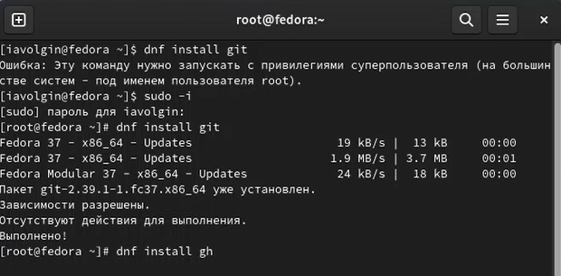{#fig:001 width=70%}

Далее нам нужно задать имя (git config --global user.name "Name Surname") и email (git config --global user.email "work@mail") владельца репозитория и настроить utf-8 в выводе сообщений git (git config --global core.quotepath false) (рис. @fig:002)

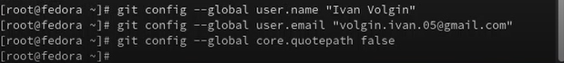{#fig:002 width=70%}

Затем задаем имя начальной ветки (будем называть её master) (git config --global init.defaultBranch master), параметр autocrlf (git config --global core.autocrlf input) и параметр safecrlf  (git config --global core.safecrlf warn) (рис. @fig:003)

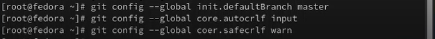{#fig:003 width=70%}

Создаем ключи ssh. Превый по алгоритму rsa с ключом размером 4096 бит (ssh-keygen -t rsa -b 4096) (рис. @fig:004), и второй по алгоритму ed25519 (ssh-keygen -t ed25519) (рис. @fig:005)

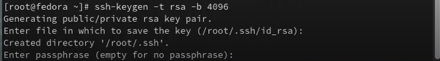{#fig:004 width=70%}

{#fig:005 width=70%}

Далее генерируем ключ pgp (gpg --full-generate-key) и из предложенных опций выбираем тип RSA and RSA, размер 4096 и бесконечный срок действия (рис. @fig:006)

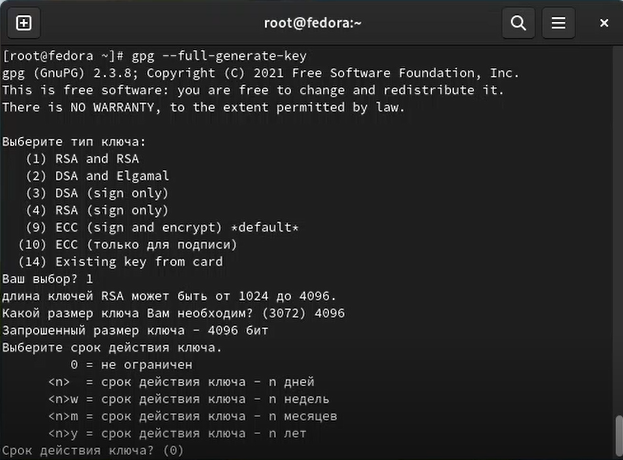{#fig:006 width=70%}

Далее GPG запросит информацию, которая будет храниться в ключе: имя, адрес электронной почты и комментарий(рис. @fig:007) 

{#fig:007 width=70%}

Далее нам нужно добавить PGP ключ в GitHub. Для этого выводим список ключей в терминал (gpg --list-secret-keys --keyid-format LONG) (рис. @fig:008) и копируем PGP ключ в буфер обмена (gpg --armor --export <PGP Fingerprint> | xclip -sel clip) (рис. @fig:009). Затем переходим в настройки GitHub, нажимаем кнопку New PGP key и вставляем полученный ключ в поле ввода (рис. @fig:010)

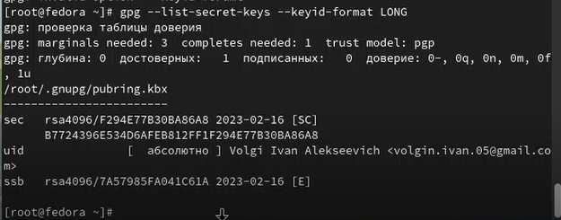{#fig:008 width=70%}

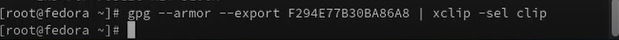{#fig:009 width=70%}

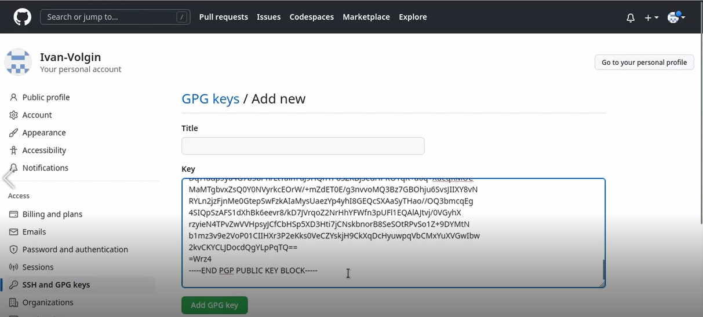{#fig:010 width=70%}

атем настраиваем автоматические подписи коммитов git (рис. @fig:011).
git config --global user.signingkey <PGP Fingerprint>
git config --global commit.gpgsign true
git config --global gpg.program $(which gpg2)

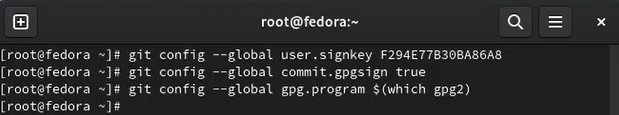{#fig:011 width=70%}

Далее мы должны настроить gh. Для начала авторизовываемся (gh auth login) (рис. @fig:012). Затем система задает несколько наводящих вопросов и авторизуемся через броузер (рис. @fig:013).

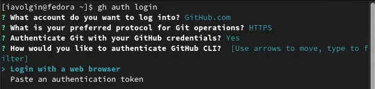{#fig:012 width=70%}

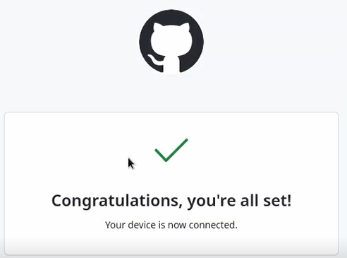{#fig:013 width=70%}

После этого создаём репозиторий курса на основе шаблона.
mkdir -p ~/work/study/2022-2023/"Операционные системы" (создаем в файловой системе директорию) (рис. @fig:014)
      cd ~/work/study/2022-2023/"Операционные системы" (переходим в файл “Операционные системы”) (рис. @fig:014)

gh repo create study_2022-2023_os-intro --template=yamadharma/course-directory-student-template –public (создаем на гитхабе репозиторий на основе шаблона) (рис. @fig:015).

git clone --recursive git@github.com:<owner>/study_2022-2023_os-intro.git os-intro (клонируем репозиторий себе в систему) (рис. @fig:016).

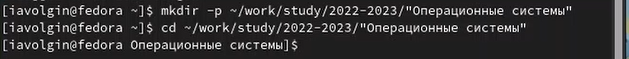{#fig:014 width=70%}

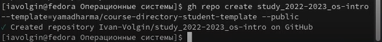{#fig:015 width=70%}

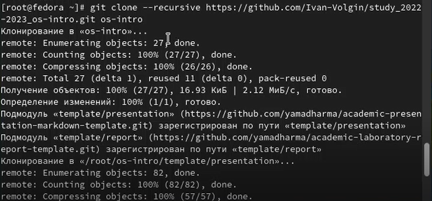{#fig:016 width=70%}

Далее настраиваем каталог курса. Переходим в каталог (cd ~/work/study/2022-2023/"Операционные системы"/os-intro), удаляем лишние файлы (rm package.json), создаем необходимые каталоги (echo os-intro > COURSE , make) и отправляем все фалы на сервер  (git add . , git commit -am 'feat(main): make course structure' , git push). Часть видео с выполнением этих команд у меня не записалась.

# Выводы

В ходе выполнения лабораторной работы я изучил идеологию и применение средств контроля версий, так же освоил умения по работе с git.

# Контрольные вопросы

1. Что такое системы контроля версий (VCS) и для решения каких задач они предназначаются?
Система управления версиями (VCS)  — программное обеспечение для облегчения работы с изменяющейся информацией. Система управления версиями позволяет хранить несколько версий одного и того же документа, при необходимости возвращаться к более ранним версиям, определять, кто и когда сделал то или иное изменение, и многое другое. Применяются они для хранения полной истории изменений, совместной работы команды над одним проектом, хранения полной информации о каждом изменении (кто и когда).
2. Объясните следующие понятия VCS и их отношения: хранилище, commit, история, рабочая копия.
Хранилище – репозиторий, в котором хранятся все документы, история их изменений и прочая информация.
Commit – отслеживание изменений, сохраняет разницу в изменениях.
История – хранилище всех изменений, позволяющее в любой момент вернуться к прежней версии проекта.
Рабочая копия – копия проекта, основанная на версии из хранилища, зачастую последней.
3. Что представляют собой и чем отличаются централизованные и децентрализованные VCS? Приведите примеры VCS каждого вида.
Централизованные VCS – одно основное хранилище проекта, из которого каждый пользователь может брать себе для работы нужную копию файлов и после их изменения возвращать обратно.
Децентрализованные VCS – личный вариант репозитория каждого пользователя, есть возможность забирать и добавлять изменения из любого репозитория.
4. Опишите действия с VCS при единоличной работе с хранилищем.
Сначала подключается удаленный репозиторий. Затем вносятся изменения и отправляются обратно на сервер.
5. Опишите порядок работы с общим хранилищем VCS.
Пользователь перед началом работы должен взять нужную ему версию проекта из хранилища, затем внести изменения и отправить их обратно на сервер, тем самым создав новую версию проекта. Старые версии тоже сохранятся.
6. Каковы основные задачи, решаемые инструментальным средством git?
Хранение всех версий проекта, истории изменений и упрощение командной работы.
7. Назовите и дайте краткую характеристику командам git.
Создание основного дерева репозитория:
    • git init
    • Получение обновлений (изменений) текущего дерева из центрального репозитория:
    • git pull
    • Отправка всех произведённых изменений локального дерева в центральный репозиторий:
    • git push
    • Просмотр списка изменённых файлов в текущей директории:
    • git status
    • Просмотр текущих изменений:
    • git diff

Сохранение текущих изменений:
    • добавить все изменённые и/или созданные файлы и/или каталоги:
    • git add .
    • Добавить конкретные изменённые и/или созданные файлы и/или каталоги:
    • git add имена_файлов
    • удалить файл и/или каталог из индекса репозитория (при этом файл и/или каталог остаётся в локальной директории):
    • git rm имена_файлов

Сохранение добавленных изменений:
    • сохранить все добавленные изменения и все изменённые файлы:
    • git commit -am 'Описание коммита'
    • сохранить добавленные изменения с внесением комментария через встроенный редактор:
    • git commit
    • создание новой ветки, базирующейся на текущей:
    • git checkout -b имя_ветки
    • переключение на некоторую ветку:
    • git checkout имя_ветки
    • (при переключении на ветку, которой ещё нет в локальном репозитории, она будет создана и связана с удалённой)
    • отправка изменений конкретной ветки в центральный репозиторий:
    • git push origin имя_ветки
    • слияние ветки с текущим деревом:
    • git merge --no-ff имя_ветки

Удаление ветки:
    • удаление локальной уже слитой с основным деревом ветки:
    • git branch -d имя_ветки
    • принудительное удаление локальной ветки:
    • git branch -D имя_ветки
    • удаление ветки с центрального репозитория:
    • git push origin :имя_ветки

8. Приведите примеры использования при работе с локальным и удалённым репозиториями.
При работе с локальным репозиторием нам может понадобиться получить обновления из центрального репозитория, тогда мы будем должны использовать команду git pull. Аналогично, чтобы внести уже проработанные изменения в удаленный репозиторий мы должны использовать команду git push.
9. Что такое и зачем могут быть нужны ветви (branches)?
Каждая ветвь представляет собой полную копию материнской ветви, но изменения которые на ней происходят не отображаются на материнской ветви ( потом можно провести слияние). Они нужны для удобства работы разных разработчиков или отделов разработки над одним проектом. Так они не мешают друг другу.
10. Как и зачем можно игнорировать некоторые файлы при commit?
При работе могут создаваться фалы, которые не нужно отправлять в удаленный репозиторий. Чтобы избежать их попадания туда можно добавить шаблоны инорируемых при добавлении в репозиторий типов файлов.

::: {#refs}
:::
