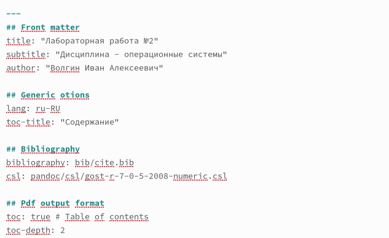
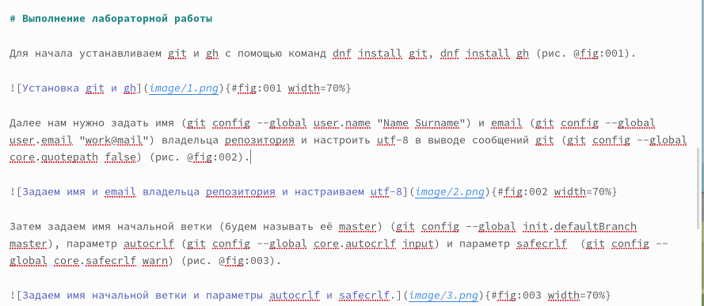
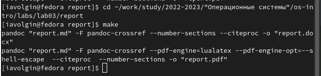

---
## Front matter
lang: ru-RU
title: лаборатоная работа №3
subtitle: Дисциплина - операционные системы
author:
  - Волгин И. А.
institute:
  - Российский университет дружбы народов, Москва, Россия
date: 25 февраля 2023

## i18n babel
babel-lang: russian
babel-otherlangs: english

## Formatting pdf
toc: false
toc-title: Содержание
slide_level: 2
aspectratio: 169
section-titles: true
theme: metropolis
header-includes:
 - \metroset{progressbar=frametitle,sectionpage=progressbar,numbering=fraction}
 - '\makeatletter'
 - '\beamer@ignorenonframefalse'
 - '\makeatother'
---

## Докладчик

:::::::::::::: {.columns align=center}
::: {.column width="70%"}

  * Волгин Иван Алексеевич
  * Студент группы НКАбд-01-22
  * Российский университет дружбы народов

:::
::: {.column width="30%"}

:::
::::::::::::::

## Цели и задачи

   Освоить язык разметки markdown.

## Задание

    Создать с помощью языка разметки markdown отчет по лабораторной работе №2

## Создание титульного листа

{#fig:001 width=80%}

## Формирование отчета

{#fig:002 width=80%}

## Компиляция отчета

{#fig:003 width=80%}

## Выводы

Я освоил язык разметки markdown

:::

