---
## Front matter
lang: ru-RU
title: Лабораторная работа №4
subtitle: Операционные системы
author:
  - Волгин И. А.
institute:
  - Российский университет дружбы народов, Москва, Россия
date: 04 марта 2023

## i18n babel
babel-lang: russian
babel-otherlangs: english

## Formatting pdf
toc: false
toc-title: Содержание
slide_level: 2
aspectratio: 169
section-titles: true
theme: metropolis
header-includes:
 - \metroset{progressbar=frametitle,sectionpage=progressbar,numbering=fraction}
 - '\makeatletter'
 - '\beamer@ignorenonframefalse'
 - '\makeatother'
---

# Информация

## Докладчик

:::::::::::::: {.columns align=center}
::: {.column width="70%"}

  * Волгин Иван Алексеевич
  * Студент по програмее Компьютрерные и информационные науки
  * Российский университет дружбы народов
  * <https://github.com/Ivan-Volgin>

:::
::: {.column width="30%"}

:::
::::::::::::::

## Цели

Приобретение практических навыков взаимодействия пользователя с системой посредством командной строки.

## Задачи

1. Выполнение заданий лабораторной работы в терминале Linux.
2. Ответы на контрольные вопросы

# Выполнение работы

## pwd

Сначала я определил имя моего домашнего каталога командой pwd.

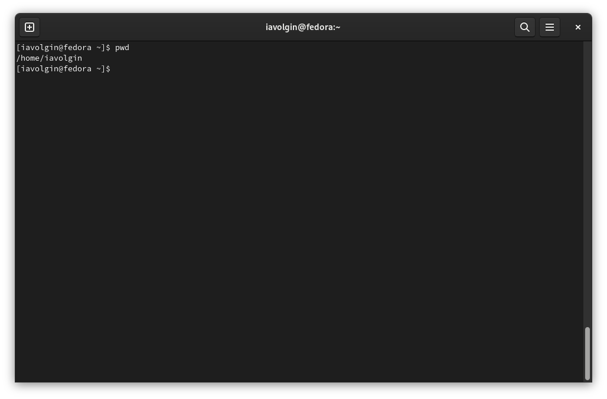{#fig:001 width=70%}

## cd и ls

Далее я перехожу в каталог tmp и вывожу на экран его содержимое, используя различные опции команды ls.

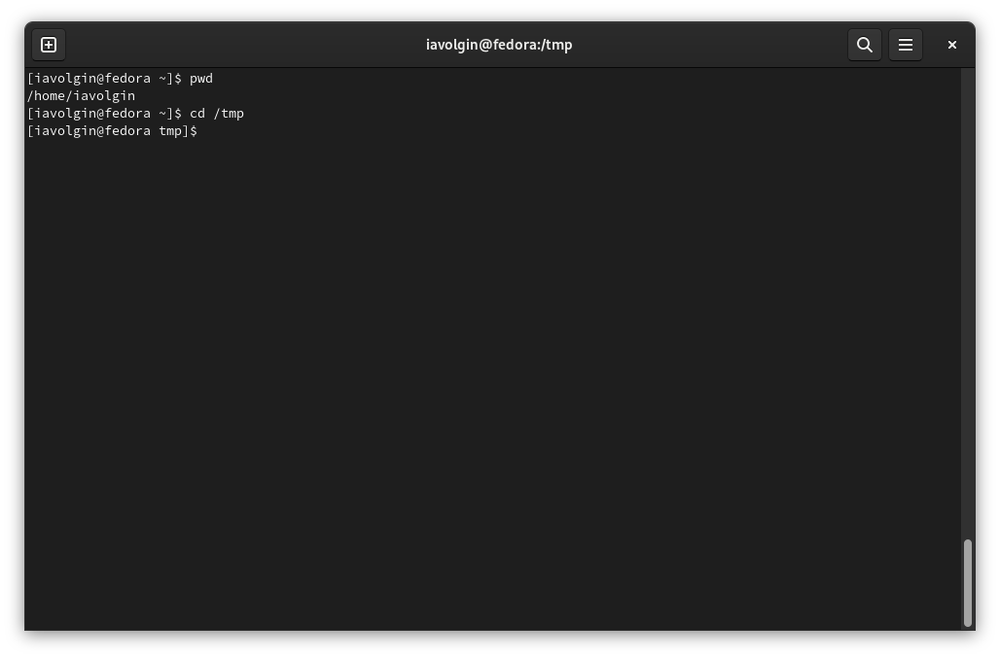{#fig:002 width=49%}
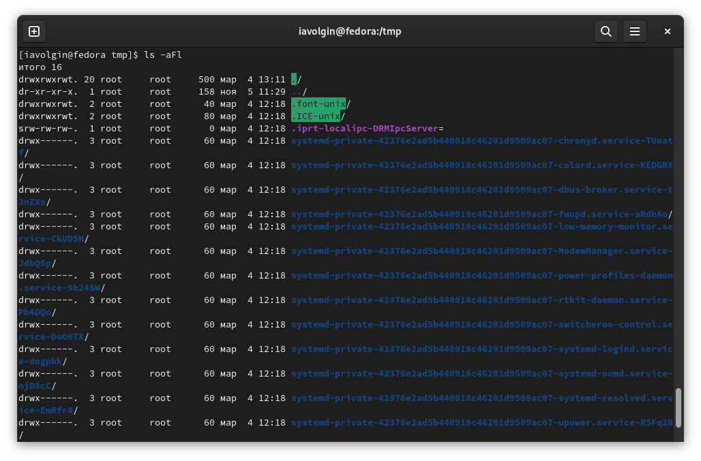{#fig:003 width=49%}

## Поиск cron

После этого я определяю, есть ли в каталоге /var/spool каталог с имененем cron. Его там нет.

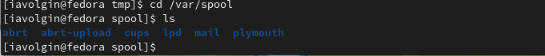{#fig:004 width=70%}

## ls -l

После этого я перешел в свой домашний каталог, вывел на экран его содережимое и определил, кто является владельцем всех каталогов. Владельцем являюсь я, это видно в 4 столбце.

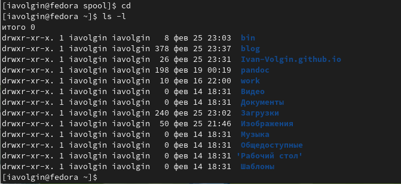{#fig:005 width=70%}

## mkdir

В домашнем каталоге создаю каталог с именем newdir.

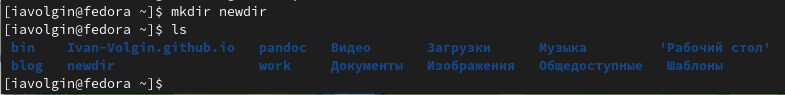{#fig:006 width=70%}

## mkdir

В каталоге newdir  создаю каталог morefun.

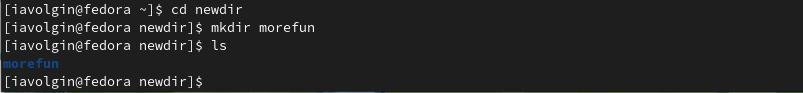{#fig:007 width=70%}

## mkdir

7. В домашнем каталоге создаю одной командой три каталога letters, memos, misk.

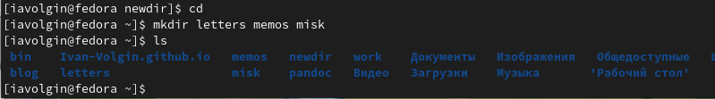{#fig:008 width=70%}

## rm и rmdir

Пытаюсь удалить каталог newdir с помощью команды rm (так же попробовал команду rmdir). Ничего не получилось, потому что команда rm  не удаляет каталоги, а rmdir удаляет только пустые каталоги.

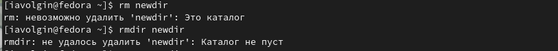{#fig:009 width=70%}

## rm -r

После этого я удаляю каталог  newdir  с помощью команды rm и ее опции -r. Проверяю правильность выполненных действий с помощью ls. Каталог был удален.

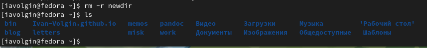{#fig:010 width=70%}

## man

С помощью команды man определяю, какую опцию команды ls нужно использовать для просмотра содержимого не только указанного каталога, но и подкаталогов, входящих в него. Это опция -R.

{#fig:011 width=70%}

## man

11. С помощью команды man определите набор опций команды ls, позволяющий отсортировать по времени последнего изменения выводимый список содержимого каталога с развёрнутым описанием файлов.

{#fig:012 width=80%}
{#fig:013 width=80%}

## man

12. Используя команду man я посмотрел описание команд cd, pwd и т.д.

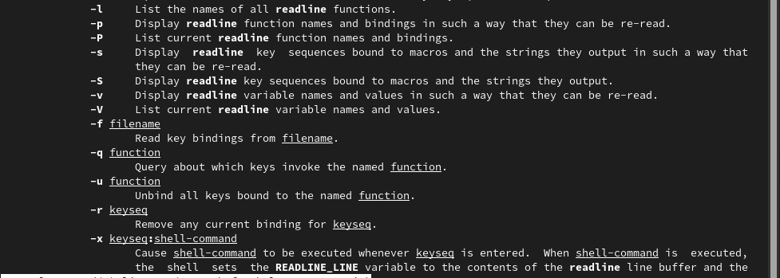{#fig:014 width=49%}
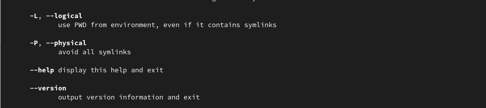{#fig:015 width=49%}

## history

С помощью команды history  и данных полученных с помощью нее выполняю модификацию выполнения команд.

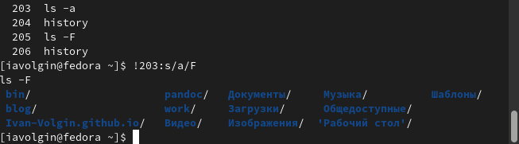{#fig:019 width=70%}

## Вывод

В ходе выполнения работы я приобрел практические навыки взаимодействия с системой посредством командной строки.
:::

