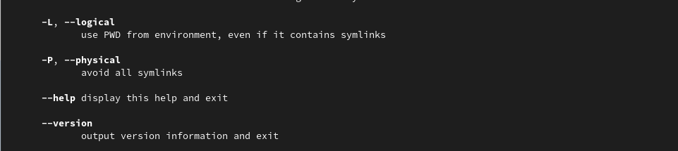

---
## Front matter
title: "Лабораторная работа №4"
subtitle: "Дисциплина - операционные системы"
author: "Волгин Иван Алексеевич"

## Generic otions
lang: ru-RU
toc-title: "Содержание"

## Bibliography
bibliography: bib/cite.bib
csl: pandoc/csl/gost-r-7-0-5-2008-numeric.csl

## Pdf output format
toc: true # Table of contents
toc-depth: 2
lof: true # List of figures
lot: true # List of tables
fontsize: 12pt
linestretch: 1.5
papersize: a4
documentclass: scrreprt
## I18n polyglossia
polyglossia-lang:
  name: russian
  options:
	- spelling=modern
	- babelshorthands=true
polyglossia-otherlangs:
  name: english
## I18n babel
babel-lang: russian
babel-otherlangs: english
## Fonts
mainfont: PT Serif
romanfont: PT Serif
sansfont: PT Sans
monofont: PT Mono
mainfontoptions: Ligatures=TeX
romanfontoptions: Ligatures=TeX
sansfontoptions: Ligatures=TeX,Scale=MatchLowercase
monofontoptions: Scale=MatchLowercase,Scale=0.9
## Biblatex
biblatex: true
biblio-style: "gost-numeric"
biblatexoptions:
  - parentracker=true
  - backend=biber
  - hyperref=auto
  - language=auto
  - autolang=other*
  - citestyle=gost-numeric
## Pandoc-crossref LaTeX customization
figureTitle: "Рис."
tableTitle: "Таблица"
listingTitle: "Листинг"
lofTitle: "Список иллюстраций"
lotTitle: "Список таблиц"
lolTitle: "Листинги"
## Misc options
indent: true
header-includes:
  - \usepackage{indentfirst}
  - \usepackage{float} # keep figures where there are in the text
  - \floatplacement{figure}{H} # keep figures where there are in the text
---

# Цель работы

Приобретение практических навыков взаимодействия пользователя с системой посредством командной строки.

# Задание

1. Определите полное имя вашего домашнего каталога. Далее относительно этого ката-
лога будут выполняться последующие упражнения.
2. Выполните следующие действия:
2.1. Перейдите в каталог /tmp.
2.2. Выведите на экран содержимое каталога /tmp. Для этого используйте команду ls
с различными опциями. Поясните разницу в выводимой на экран информации.
2.3. Определите, есть ли в каталоге /var/spool подкаталог с именем cron?
2.4. Перейдите в Ваш домашний каталог и выведите на экран его содержимое. Опре-
делите, кто является владельцем файлов и подкаталогов?
3. Выполните следующие действия:
3.1. В домашнем каталоге создайте новый каталог с именем newdir.
3.2. В каталоге ~/newdir создайте новый каталог с именем morefun.
3.3. В домашнем каталоге создайте одной командой три новых каталога с именами
letters, memos, misk. Затем удалите эти каталоги одной командой.
3.4. Попробуйте удалить ранее созданный каталог ~/newdir командой rm. Проверьте,
был ли каталог удалён.
3.5. Удалите каталог ~/newdir/morefun из домашнего каталога. Проверьте, был ли
каталог удалён.
4. С помощью команды man определите, какую опцию команды ls нужно использо-
вать для просмотра содержимое не только указанного каталога, но и подкаталогов,
входящих в него.
5. С помощью команды man определите набор опций команды ls, позволяющий отсорти-
ровать по времени последнего изменения выводимый список содержимого каталога
с развёрнутым описанием файлов.
6. Используйте команду man для просмотра описания следующих команд: cd, pwd, mkdir,
rmdir, rm. Поясните основные опции этих команд.
7. Используя информацию, полученную при помощи команды history, выполните мо-
дификацию и исполнение нескольких команд из буфера команд.

# Теоретическое введение

Команда cd используется для перемещения по файловой системе опера-
ционной системы типа Linux.

Для определения абсолютного пути к текущему каталогу используется
команда pwd (print working directory).

Команда ls используется для просмотра содержимого каталога.
Формат команды:
ls [-опции] [путь]

Команда mkdir используется для создания каталогов.
Формат команды:
mkdir имя_каталога1 [имя_каталога2...]

Команда rm используется для удаления файлов и/или каталогов.
Формат команды:
rm [-опции] [файл]

Для вывода на экран списка ранее выполненных команд исполь-
зуется команда history. Выводимые на экран команды в списке нумеруются. К любой
команде из выведенного на экран списка можно обратиться по её номеру в списке,
воспользовавшись конструкцией !<номер_команды>.

# Выполнение лабораторной работы

1. Сначала я определил имя моего домашнего каталога командой pwd (рис. @fig:001).

{#fig:001 width=70%}

2. Далее я перехожу в каталог tmp (рис. @fig:002) и вывожу на экран его содержимое, используя различные опции команды ls (рис. @fig:003).

{#fig:002 width=70%}

{#fig:003 width=70%}

3. После этого я определяю, есть ли в каталоге /var/spool каталог с имененем cron. Его там нет (рис. @fig:004).

{#fig:004 width=70%}

4. После этого я перешел в свой домашний каталог, вывел на экран его содрежимое и определил, кто является владельцем всех каталогов. Владельцем являюсь я, это видно в 4 столбце (рис. @fig:005).

{#fig:005 width=70%}

5. В домашнем каталоге создаю каталог с именем newdir (рис. @fig:006).

{#fig:006 width=70%}

6. В каталоге newdir  создаю каталог morefun (рис. @fig:007).

{#fig:007 width=70%}

7. В домашнем каталоге создаю одной командой три каталога letters, memos, misk (рис. @fig:008).

{#fig:008 width=70%}

8. Пытаюсь удалить каталог newdir с помощью команды rm (так же попробовал команду rmdir). Ничего не получилось, потому что команда rm  не удаляет каталоги, а rmdir удаляет только пустые каталоги (рис. @fig:009).

{#fig:009 width=70%}

9. После этого я удаляю каталог  newdir  с помощью команды rm и ее опции -r. Проверяю правильность выполненных действий с помощью ls. Каталог был удален (рис. @fig:010).

{#fig:010 width=70%}

10. С помощью команды man определяю, какую опцию команды ls нужно использовать для просмотра содержимого не только указанного каталога, но и подкаталогов, входящих в него. Это опция -R (рис. @fig:011).

{#fig:011 width=70%}

11. С помощью команды man определите набор опций команды ls, позволяющий отсортировать по времени последнего изменения (рис. @fig:012) выводимый список содержимого каталога с развёрнутым описанием файлов (рис. @fig:013).

{#fig:012 width=70%}

{#fig:013 width=70%}

12. Используя команду man я посмотрел описание команд cd (рис. @fig:014), pwd (рис. @fig:015), mkdir (рис. @fig:016), rmdir (рис. @fig:017), rm (рис. @fig:018).

{#fig:014 width=70%}

{#fig:015 width=70%}

{#fig:016 width=70%}

{#fig:017 width=70%}

{#fig:018 width=70%}

13. С помощью команды history  и данных полученных с помощью нее выполняю модификацию выполнения команд (рис. @fig:019).

{#fig:019 width=70%}

# Выводы

В ходе выполнения работы я приобрел практические навыки взаимодействия с системой посредством командной строки.

# Контрольные вопросы

1. Что такое командная строка?

Командой в операционной системе называется записанный по
специальным правилам текст (возможно с аргументами), представляющий собой ука-
зание на выполнение какой-либо функций (или действий) в операционной системе.

2. При помощи какой команды можно определить абсолютный путь текущего каталога?
Приведите пример.

С помощью команды pwd (рис. @fig:020).

{#fig:020 width=70%}

3. При помощи какой команды и каких опций можно определить только тип файлов
и их имена в текущем каталоге? Приведите примеры.

С помощью команды ls и ее опции -F (рис. @fig:021)

{#fig:021 width=70%}

4. Каким образом отобразить информацию о скрытых файлах? Приведите примеры.

С помощью команды ls и ее опции -a (рис. @fig:022)

{#fig:022 width=70%}

5. При помощи каких команд можно удалить файл и каталог? Можно ли это сделать
одной и той же командой? Приведите примеры.

Можно удалить с помощью команд rm и rmdir. Одной и той же командой это сделать нельзя, потому что rm не удаляет каталоги без мпециальных опций, а rmdir удаляет только пустые каталоги (рис. @fig:023), (рис. @fig:024).

{#fig:023 width=70%}

{#fig:024 width=70%}

6. Каким образом можно вывести информацию о последних выполненных пользовате-
лем командах? работы?

С помощью команды history (рис. @fig:025)

{#fig:025 width=70%}

7. Как воспользоваться историей команд для их модифицированного выполнения? При-
ведите примеры.

Нужно вывести историю команд, а потом воспользоваться командой !<номер_команды>:s/<что_меняем>/<на_что_меняем> (рис. @fig:026)

{#fig:026 width=70%}

8. Приведите примеры запуска нескольких команд в одной строке.

Указываем их через ";" (рис. @fig:027).

{#fig:027 width=70%}

9. Дайте определение и приведите примера символов экранирования.

Если в заданном контексте встречаются специальные символы (типа «.»,
«/», «*» и т.д.), надо перед ними поставить символ экранирования \ (обратный слэш).

10. Охарактеризуйте вывод информации на экран после выполнения команды ls с опцией
l.

При выполнении команды ls с опцией l на экран выводится подробная информация о файлах и каталогах.

– тип файла,
– право доступа,
– число ссылок,
– владелец,
– размер,
– дата последней ревизии,
– имя файла или каталога.

11. Что такое относительный путь к файлу? Приведите примеры использования относи-
тельного и абсолютного пути при выполнении какой-либо команды.

Относительный путь файла указывается относительно текущей директории пользователя, а абсолютный путь указывается начиная с корневого каталога.

В примере я показал, что используя абсолютный путь к файлу можно перейти к данному файлу находясь в домашней директории, даже если файл вложен в большое количество других. А с помощью относительного пути к файлу можно перейти в каталог или файл, который лежит в текущем каталоге, но вот уже в другие файлы, которые вложены в подкаталоги перейти не получится (рис. @fig:028).

{#fig:028 width=70%}

12. Как получить информацию об интересующей вас команде?

С помощью команды man [интересующая команда] или с помощью help [интересующая команда]

13. Какая клавиша или комбинация клавиш служит для автоматического дополнения
вводимых команд?

Для автоматического дополнения вводимых команд можно использовать клавишу Tab.

::: {#refs}
:::
