---
## Front matter
lang: ru-RU
title: Лабораторная работа №5
subtitle: Операционные системы
author:
  - Волгин И.А.
institute:
  - Российский университет дружбы народов, Москва, Россия
date: 11 марта 2023

## i18n babel
babel-lang: russian
babel-otherlangs: english

## Formatting pdf
toc: false
toc-title: Содержание
slide_level: 2
aspectratio: 169
section-titles: true
theme: metropolis
header-includes:
 - \metroset{progressbar=frametitle,sectionpage=progressbar,numbering=fraction}
 - '\makeatletter'
 - '\beamer@ignorenonframefalse'
 - '\makeatother'
---

# Информация

## Докладчик

  * Волгин Иван Алексеевич
  * Студент по программе Компьютерные и информационные науки
  * Российский университет дружбы народов
  * <https://github.com/Ivan-Volgin>

## Цели

Ознакомление с файловой системой Linux, её структурой, именами и содержанием каталогов. Приобретение практических навыков по применению команд для работы с файлами и каталогами, по управлению процессами (и работами), по проверке использования диска и обслуживанию файловой системы.

## Задачи

- Повторить примеры из файла по лабораторной работе.
- Выполнить задания лабораторной работы

## Выполнение примеров по копированию фалов и каталогов}

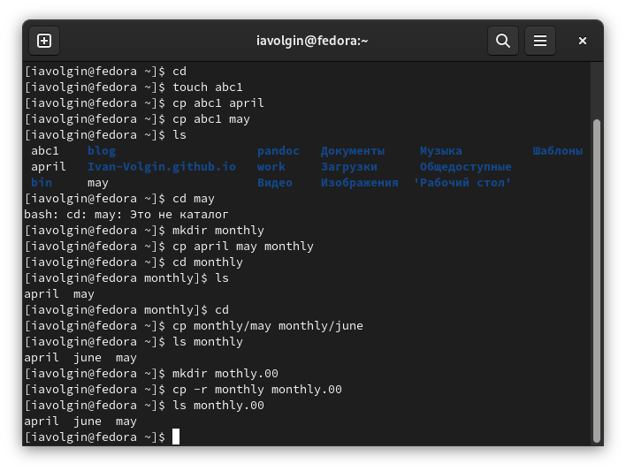{#fig:001 width=70%}

## Копирование monthly.00  в /tmp

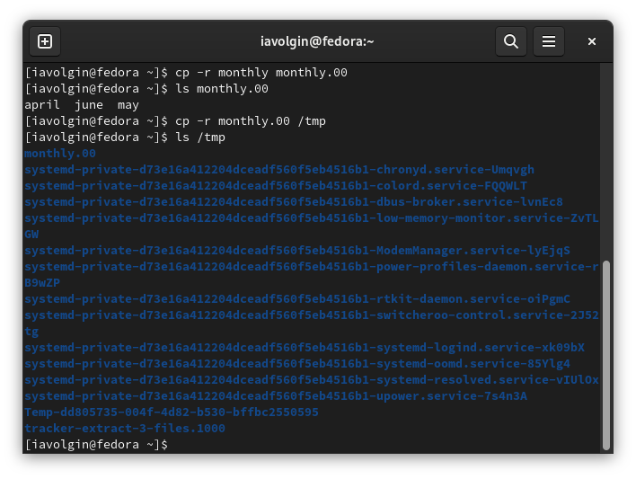{#fig:002 width=70%}

## Выполнение заданий по перемещению и переименованию фалов

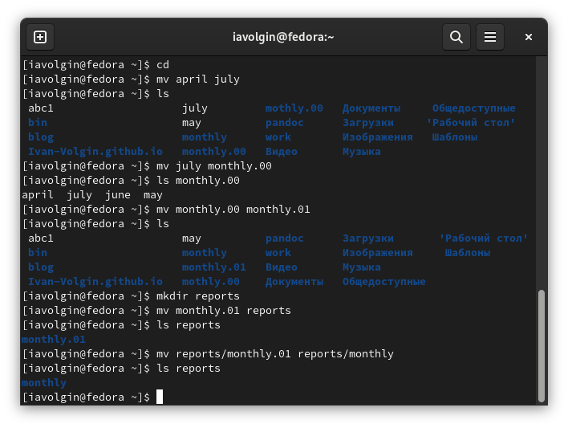{#fig:003 width=70%}

## Переименование каталога не являющегося текущим

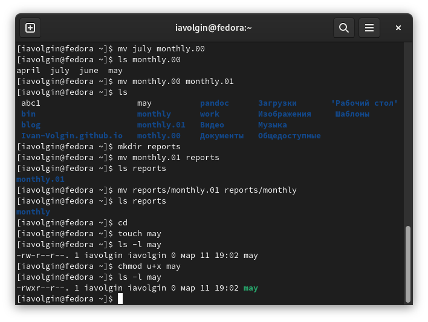{#fig:004 width=70%}

## Выполнение примеров по изменению прав доступа

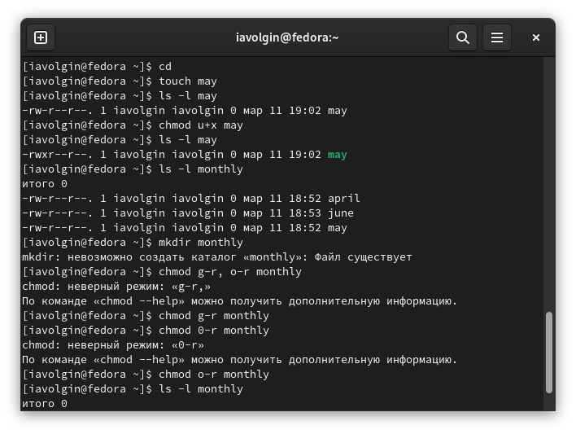{#fig:005 width=70%}

## Создание файла ~/abc1 с правом записи для членов группы

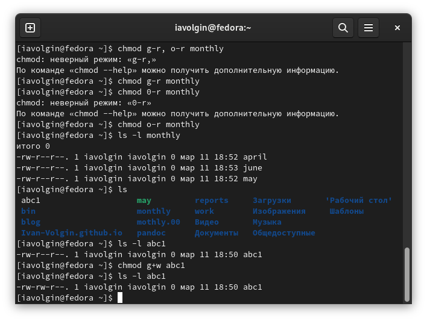{#fig:006 width=70%}

## Проверяю целостность файловой системы

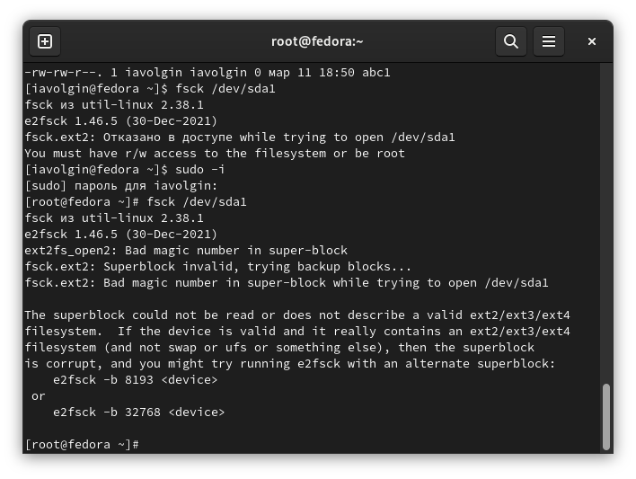{#fig:007 width=70%}

## Переименование файла io.h в equipment и создание ski.plases

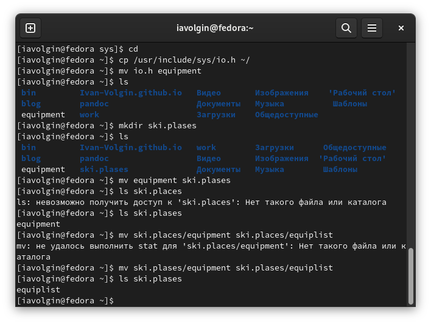{#fig:008 width=70%}

## Создание и переименование файлов

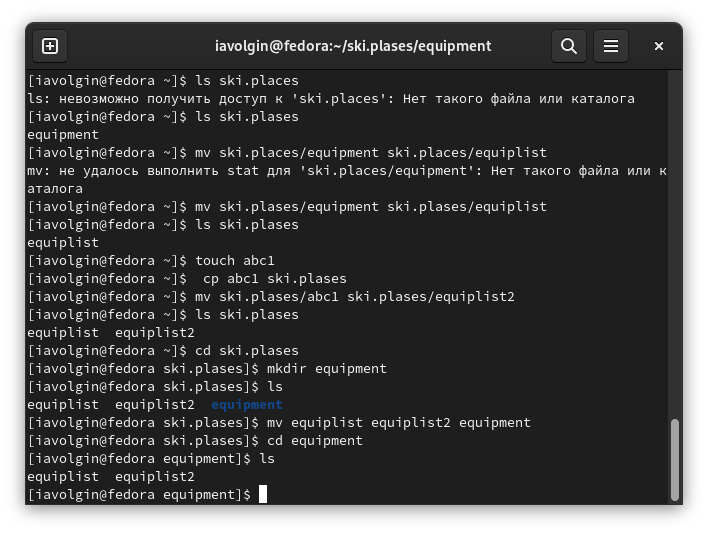{#fig:009 width=70%}

## Создание и перемещение каталога newdir

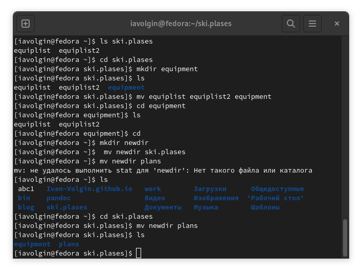{#fig:010 width=70%}

## Изменение прав доступа к файлам

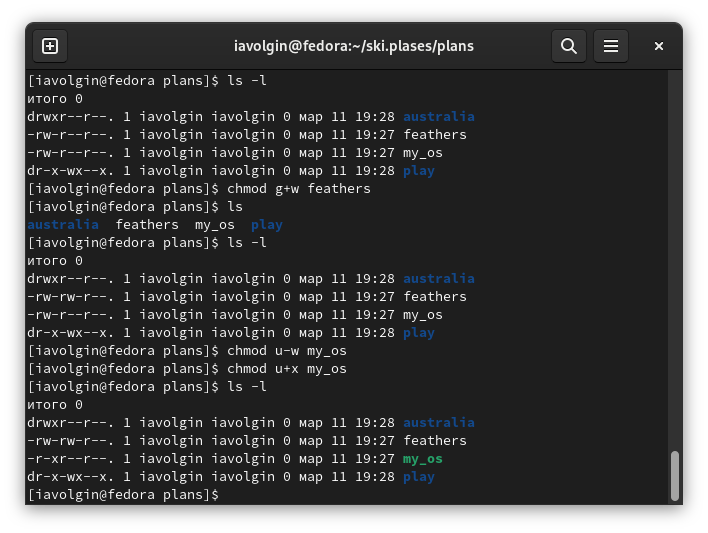{#fig:011 width=70%}

## Cмотрю содержимое файла /etc/password

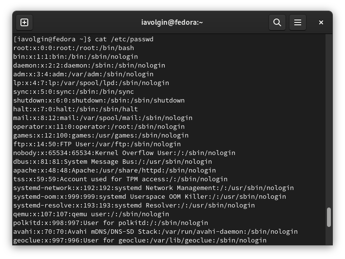{#fig:012 width=70%}

## Перемщаю файл ~/file.old в каталог ~/play

{#fig:013 width=70%}

## Копирую play в fun, перемещаю fun в play и переименовываю в games

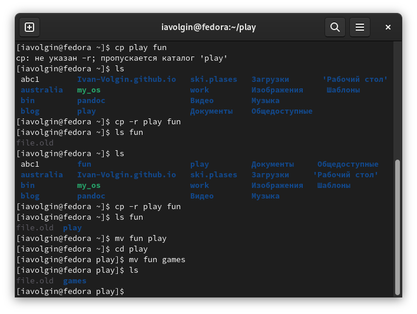{#fig:014 width=70%}

## Убираю право владельца на чтение у feathers и пытаюсь просмотреть его

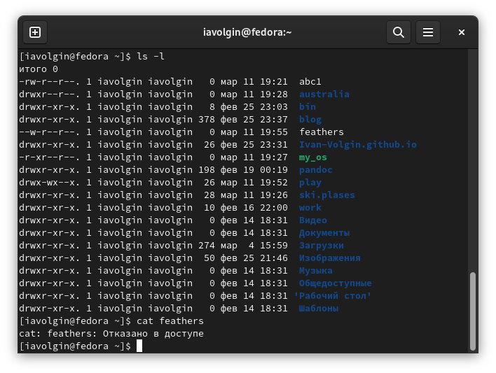{#fig:015 width=70%}

## Убираю право владельца на исполнение у play и пытаюсь его открыть

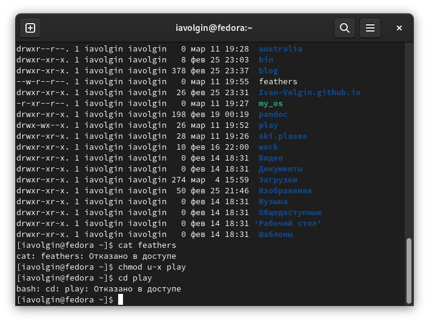{#fig:016 width=70%}

## Выводы

В ходе выполнения лабораторной работы №5 я ознакомился с файловой системой Linux, её структурой, именами и содержанием каталогов. Приобрел практические навыки по применению команд для работы с файлами и каталогами, по управлению процессами (и работами), по проверке использования диска и обслуживанию файловой системы.

:::

