---
## Front matter
title: "Лабораторная работа №5"
subtitle: "Дисциплина - операционные системы"
author: "Волгин Иван Алексеевич"

## Generic otions
lang: ru-RU
toc-title: "Содержание"

## Bibliography
bibliography: bib/cite.bib
csl: pandoc/csl/gost-r-7-0-5-2008-numeric.csl

## Pdf output format
toc: true # Table of contents
toc-depth: 2
lof: true # List of figures
lot: true # List of tables
fontsize: 12pt
linestretch: 1.5
papersize: a4
documentclass: scrreprt
## I18n polyglossia
polyglossia-lang:
  name: russian
  options:
	- spelling=modern
	- babelshorthands=true
polyglossia-otherlangs:
  name: english
## I18n babel
babel-lang: russian
babel-otherlangs: english
## Fonts
mainfont: PT Serif
romanfont: PT Serif
sansfont: PT Sans
monofont: PT Mono
mainfontoptions: Ligatures=TeX
romanfontoptions: Ligatures=TeX
sansfontoptions: Ligatures=TeX,Scale=MatchLowercase
monofontoptions: Scale=MatchLowercase,Scale=0.9
## Biblatex
biblatex: true
biblio-style: "gost-numeric"
biblatexoptions:
  - parentracker=true
  - backend=biber
  - hyperref=auto
  - language=auto
  - autolang=other*
  - citestyle=gost-numeric
## Pandoc-crossref LaTeX customization
figureTitle: "Рис."
tableTitle: "Таблица"
listingTitle: "Листинг"
lofTitle: "Список иллюстраций"
lotTitle: "Список таблиц"
lolTitle: "Листинги"
## Misc options
indent: true
header-includes:
  - \usepackage{indentfirst}
  - \usepackage{float} # keep figures where there are in the text
  - \floatplacement{figure}{H} # keep figures where there are in the text
---

# Цель работы

Ознакомление с файловой системой Linux, её структурой, именами и содержанием каталогов. Приобретение практических навыков по применению команд для работы с файлами и каталогами, по управлению процессами (и работами), по проверке использования диска и обслуживанию файловой системы.

# Задание

1. Выполните все примеры, приведённые в первой части описания лабораторной работы.
2. Выполните следующие действия, зафиксировав в отчёте по лабораторной работе
используемые при этом команды и результаты их выполнения.
2.1. Скопируйте файл /usr/include/sys/io.h в домашний каталог и назовите его
equipment. Если файла io.h нет, то используйте любой другой файл в каталоге
/usr/include/sys/ вместо него.
2.2. В домашнем каталоге создайте директорию ~/ski.plases.
2.3. Переместите файл equipment в каталог ~/ski.plases.
2.4. Переименуйте файл ~/ski.plases/equipment в ~/ski.plases/equiplist.
2.5. Создайте в домашнем каталоге файл abc1 и скопируйте его в каталог
~/ski.plases, назовите его equiplist2.
2.6. Создайте каталог с именем equipment в каталоге ~/ski.plases.
2.7. Переместите файлы ~/ski.plases/equiplist и equiplist2 в каталог
~/ski.plases/equipment.
2.8. Создайте и переместите каталог ~/newdir в каталог ~/ski.plases и назовите
его plans.
Кулябов Д. С. и др. Операционные системы 53
3. Определите опции команды chmod, необходимые для того, чтобы присвоить перечис-
ленным ниже файлам выделенные права доступа, считая, что в начале таких прав
нет:
3.1. drwxr--r-- ... australia
3.2. drwx--x--x ... play
3.3. -r-xr--r-- ... my_os
3.4. -rw-rw-r-- ... feathers
При необходимости создайте нужные файлы.
4. Проделайте приведённые ниже упражнения, записывая в отчёт по лабораторной
работе используемые при этом команды:
4.1. Просмотрите содержимое файла /etc/password.
4.2. Скопируйте файл ~/feathers в файл ~/file.old.
4.3. Переместите файл ~/file.old в каталог ~/play.
4.4. Скопируйте каталог ~/play в каталог ~/fun.
4.5. Переместите каталог ~/fun в каталог ~/play и назовите его games.
4.6. Лишите владельца файла ~/feathers права на чтение.
4.7. Что произойдёт, если вы попытаетесь просмотреть файл ~/feathers командой
cat?
4.8. Что произойдёт, если вы попытаетесь скопировать файл ~/feathers?
4.9. Дайте владельцу файла ~/feathers право на чтение.
4.10. Лишите владельца каталога ~/play права на выполнение.
4.11. Перейдите в каталог ~/play. Что произошло?
4.12. Дайте владельцу каталога ~/play право на выполнение.
5. Прочитайте man по командам mount, fsck, mkfs, kill и кратко их охарактеризуйте,
приведя примеры

# Теоретическое введение

1. Для создания текстового файла можно использовать команду touch.
2. Для просмотра файлов небольшого размера можно использовать команду cat.
3. Для просмотра файлов постранично удобнее использовать команду less.
4. Команда cp используется для копирования файлов и каталогов.
5. Команды mv и mvdir предназначены для перемещения и переименования файлов
и каталогов.
6. Каждый файл или каталог имеет права доступа.
В сведениях о файле или каталоге указываются:
– тип файла (символ (-) обозначает файл, а символ (d) — каталог);
– права для владельца файла (r — разрешено чтение, w — разрешена запись, x — разре-
шено выполнение, - — право доступа отсутствует);
– права для членов группы (r — разрешено чтение, w — разрешена запись, x — разрешено
выполнение, - — право доступа отсутствует);
– права для всех остальных (r — разрешено чтение, w — разрешена запись, x — разрешено
выполнение, - — право доступа отсутствует)
7. Права доступа к файлу или каталогу можно изменить, воспользовавшись командой
chmod. Сделать это может владелец файла (или каталога) или пользователь с правами
администратора.
8. Режим (в формате команды) имеет следующие компоненты структуры и способ запи-
си:
= установить право
- лишить права
+ дать право
r чтение
w запись
50 Лабораторная работа No 5. Анализ файловой системы Linux. Команды для работы ...
x выполнение
u (user) владелец файла
g (group) группа, к которой принадлежит владелец файла
o (others) все остальные
В работе с правами доступа можно использовать их цифровую запись (восьмеричное
значение) вместо символьной

# Выполнение лабораторной работы

1. Для начала мне нужно выполнить все примеры, которые были показаны в теоретическом введении лабораторной работы. Скопировал файл ~/abc1 в файл april
и в файл may (рис. @fig:001). Далее скопировал файлы april и may в каталог monthly (рис. @fig:001). После этого скопировал файл monthly/may в файл с именем june (рис. @fig:001). И наконец скопировал каталог monthly в каталог
monthly.00(рис. @fig:001).

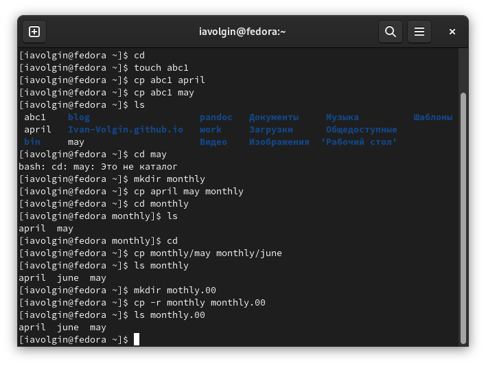{#fig:001 width=70%}

2. После этого я скопировал каталог monthly.00  в какталог  /tmp (рис. @fig:002). 

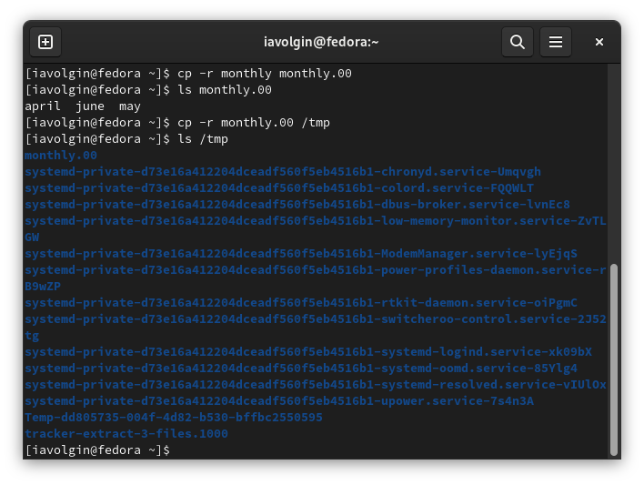{#fig:002 width=70%}

3. Далее идут примеры на перемещение и переименование файлов. Переименование файлов в текущем каталоге (изменить название файла april на july в домашнем каталоге) (рис. @fig:003). Перемещение файлов в другой каталог (переместил файл july в каталог monthly.00) (рис. @fig:003). Переименование каталогов в текущем каталоге (переименовал каталог monthly.00 в monthly.01) (рис. @fig:003). Перемещение каталога в другой каталог (переместил каталог monthly.01в каталог reports) (рис. @fig:003). Переименование каталога, не являющегося текущим (переименовал каталог reports/monthly.01 в reports/monthly) (рис. @fig:004).

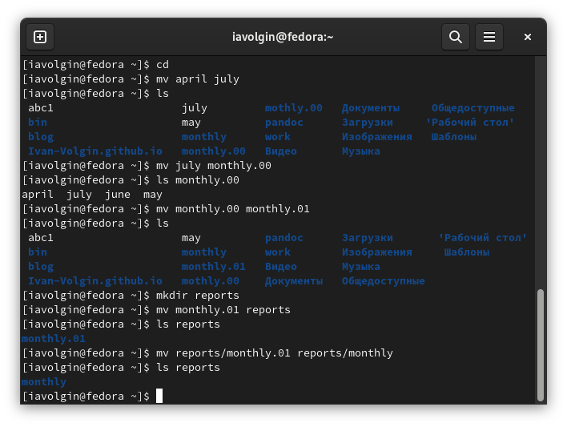{#fig:003 width=70%}

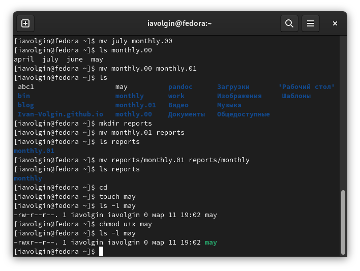{#fig:004 width=70%}

4. После этого выполняем примеры на изменение прав доступа. Создаю файл ~/may с правом выполнения для владельца (рис. @fig:005). Лишаю владельца файла ~/may права на выполнение (рис. @fig:005). Создаю каталог monthly с запретом на чтение для членов группы и всех остальных польз ователей (рис. @fig:005).

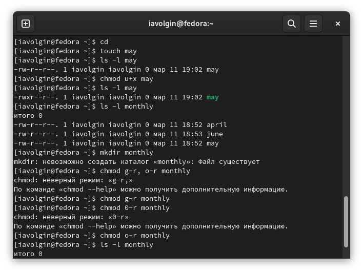{#fig:005 width=70%}

5. Создаю файл ~/abc1 с правом записи для членов группы и заканчиваю примеры по изменению прав доступа (рис. @fig:006).

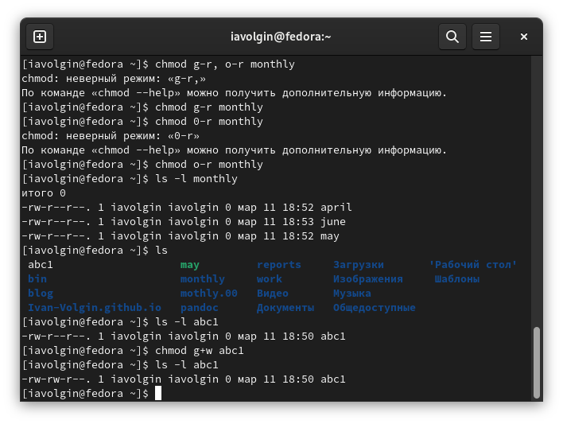{#fig:006 width=70%}

6. С помощью команды fsck проверяю целостность файловой системы (рис. @fig:007).

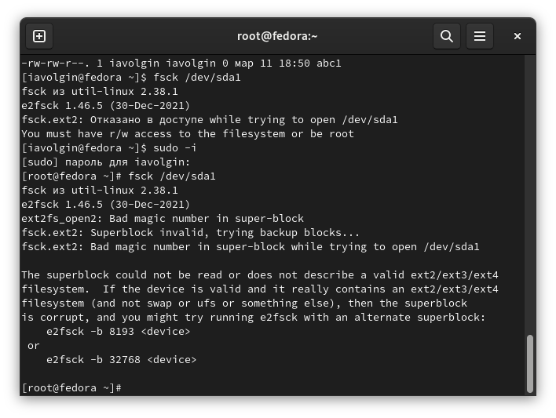{#fig:007 width=70%}

7. Далее выполнение примеров заканчивается и начинается выполнение заданий лабораторной работы.
Я скопировал файл /usr/include/sys/io.h в домашний каталог и назвал его equipment (рис. @fig:008). В домашнем каталоге создайл директорию ~/ski.plases (рис. @fig:008).

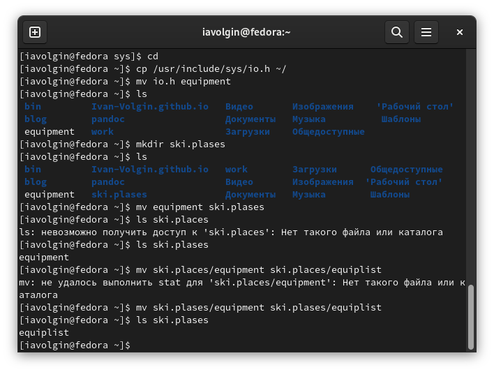{#fig:008 width=70%}

8. Переместил файл equipment в каталог ~/ski.plases (рис. @fig:009) и переименовал его в ~/ski.plases/equiplist (рис. @fig:009). Создал в домашнем каталоге файл abc1 и скопировал его в каталог
~/ski.plases, назвал его equiplist2 (рис. @fig:009). Далее создал каталог с именем equipment в каталоге ~/ski.plases и переместил файлы ~/ski.plases/equiplist и equiplist2 в каталог ~/ski.plases/equipment (рис. @fig:009).

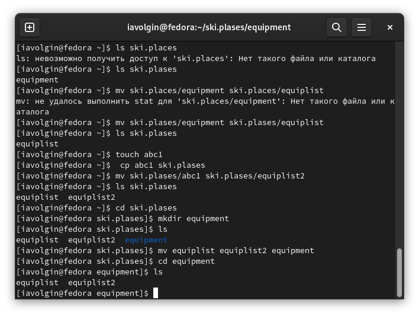{#fig:009 width=70%}

9. Далее создал и переместил каталог ~/newdir в каталог ~/ski.plases и назвал его plans (рис. @fig:010)

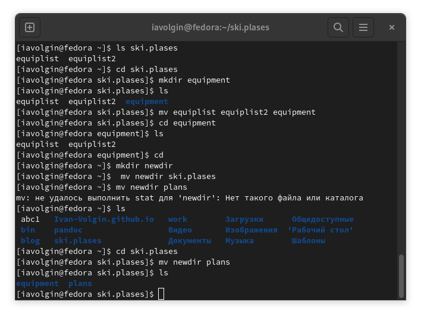{#fig:010 width=70%}

10. Определяю опции команды chmod, необходимые для того, чтобы присвоить перечисленным ниже файлам выделенные права доступа, считая, что в начале таких прав нет (рис. @fig:011)
drwxr--r-- ... australia
drwx--x--x ... play
-r-xr--r-- ... my_os
-rw-rw-r-- ... feathers

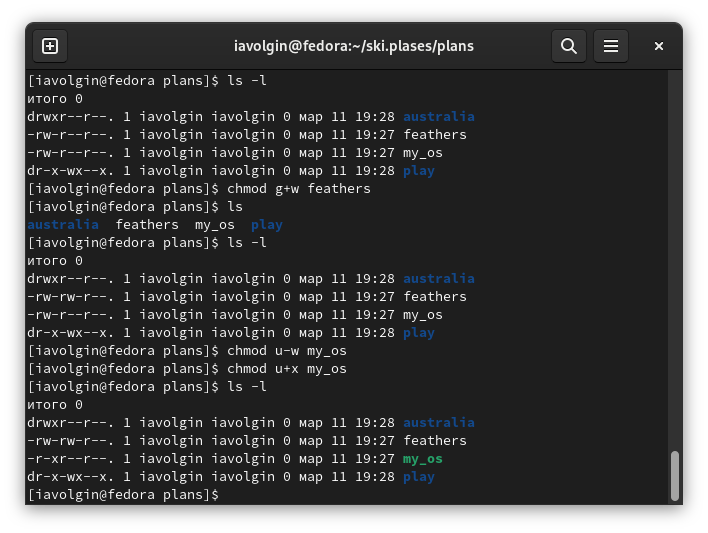{#fig:011 width=70%}

11. После этого выполняю перечень заданий, указываю, какие команды использовал.
- Просмотрите содержимое файла /etc/password. (cat /etc/passwd) (рис. @fig:012)
- Скопируйте файл ~/feathers в файл ~/file.old.
- Переместите файл ~/file.old в каталог ~/play ( mv file.old play) (рис. @fig:013).
- Скопируйте каталог ~/play в каталог ~/fun (cp play fun) (рис. @fig:014)
- Переместите каталог ~/fun в каталог ~/play и назовите его games (mv fun play, mv fun games) (рис. @fig:014)
- Лишите владельца файла ~/feathers права на чтение (chmod u-r feathers).
- Что произойдёт, если вы попытаетесь просмотреть файл ~/feathers командой cat? (отказано в доступе) (рис. @fig:015)
- Что произойдёт, если вы попытаетесь скопировать файл ~/feathers?
- Дайте владельцу файла ~/feathers право на чтение (chmod u+r feathers)
- Лишите владельца каталога ~/play права на выполнение (chmod u-x play) (рис. @fig:016).
- Перейдите в каталог ~/play. Что произошло? (отказано в доступе) (рис. @fig:016).
- Дайте владельцу каталога ~/play право на выполнение (chmod u+x play) (рис. @fig:016).

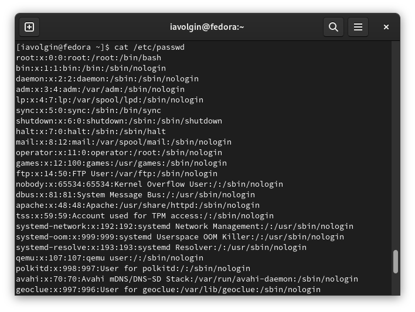{#fig:012 width=70%}

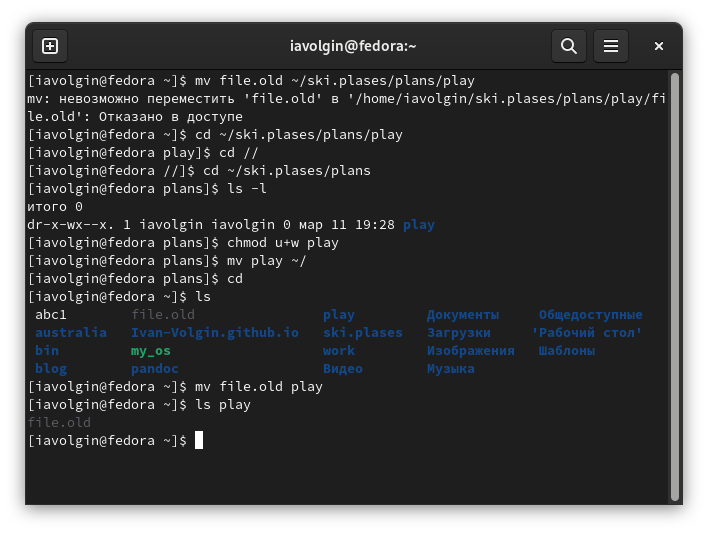{#fig:013 width=70%}

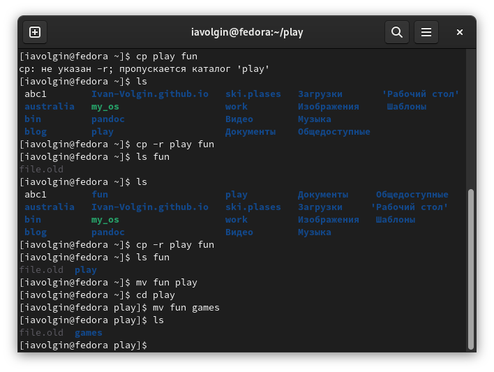{#fig:014 width=70%}

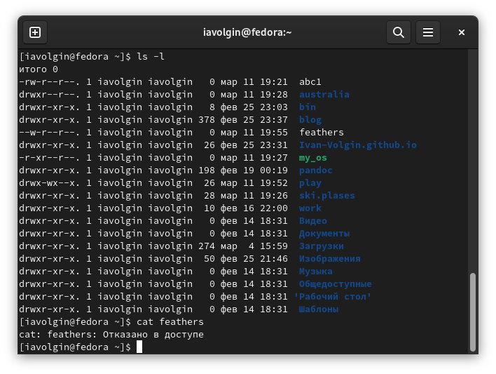{#fig:015 width=70%}

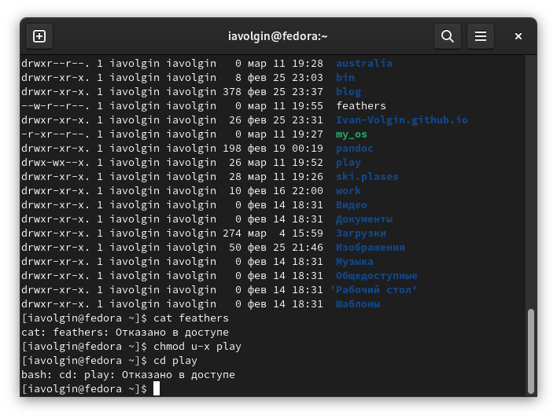{#fig:016 width=70%}

# Выводы

В ходе выполнения лабораторной работы №5 я ознакомился с файловой системой Linux, её структурой, именами и содержанием каталогов. Приобрел практические навыки по применению команд для работы с файлами и каталогами, по управлению процессами (и работами), по проверке использования диска и обслуживанию файловой системы.

::: {#refs}
:::
