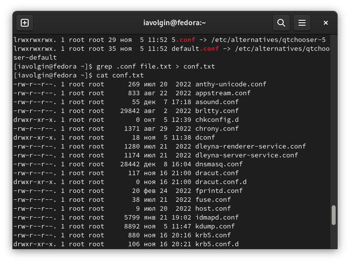

---
## Front matter
title: "Лабораторная работа №6"
subtitle: "Дисциплина - операционные системы"
author: "Волгин Иван Алексеевич"

## Generic otions
lang: ru-RU
toc-title: "Содержание"

## Bibliography
bibliography: bib/cite.bib
csl: pandoc/csl/gost-r-7-0-5-2008-numeric.csl

## Pdf output format
toc: true # Table of contents
toc-depth: 2
lof: true # List of figures
lot: true # List of tables
fontsize: 12pt
linestretch: 1.5
papersize: a4
documentclass: scrreprt
## I18n polyglossia
polyglossia-lang:
  name: russian
  options:
	- spelling=modern
	- babelshorthands=true
polyglossia-otherlangs:
  name: english
## I18n babel
babel-lang: russian
babel-otherlangs: english
## Fonts
mainfont: PT Serif
romanfont: PT Serif
sansfont: PT Sans
monofont: PT Mono
mainfontoptions: Ligatures=TeX
romanfontoptions: Ligatures=TeX
sansfontoptions: Ligatures=TeX,Scale=MatchLowercase
monofontoptions: Scale=MatchLowercase,Scale=0.9
## Biblatex
biblatex: true
biblio-style: "gost-numeric"
biblatexoptions:
  - parentracker=true
  - backend=biber
  - hyperref=auto
  - language=auto
  - autolang=other*
  - citestyle=gost-numeric
## Pandoc-crossref LaTeX customization
figureTitle: "Рис."
tableTitle: "Таблица"
listingTitle: "Листинг"
lofTitle: "Список иллюстраций"
lotTitle: "Список таблиц"
lolTitle: "Листинги"
## Misc options
indent: true
header-includes:
  - \usepackage{indentfirst}
  - \usepackage{float} # keep figures where there are in the text
  - \floatplacement{figure}{H} # keep figures where there are in the text
---

# Цель работы

Ознакомление с инструментами поиска файлов и фильтрации текстовых данных.
Приобретение практических навыков: по управлению процессами (и заданиями), по проверке использования диска и обслуживанию файловых систем.

# Задание

1. Осуществите вход в систему, используя соответствующее имя пользователя.
2. Запишите в файл file.txt названия файлов, содержащихся в каталоге /etc. Допишите в этот же файл названия файлов, содержащихся в вашем домашнем каталоге.
3. Выведите имена всех файлов из file.txt, имеющих расширение .conf, после чего запишите их в новый текстовой файл conf.txt.
4. Определите, какие файлы в вашем домашнем каталоге имеют имена, начинавшиеся с символа c? Предложите несколько вариантов, как это сделать.
5. Выведите на экран (по странично) имена файлов из каталога /etc, начинающиеся с символа h.
6. Запустите в фоновом режиме процесс, который будет записывать в файл ~/logfile файлы, имена которых начинаются с log.
7. Удалите файл ~/logfile.
8. Запустите из консоли в фоновом режиме редактор gedit.
9. Определите идентификатор процесса gedit, используя команду ps, конвейер и фильтр grep. Как ещё можно определить идентификатор процесса?
10. Прочтите справку (man) команды kill, после чего используйте её для завершения процесса gedit.
11. Выполните команды df и du, предварительно получив более подробную информацию об этих командах, с помощью команды man.
12. Воспользовавшись справкой команды find, выведите имена всех директорий, имеющихся в вашем домашнем каталоге.

# Теоретическое введение

1. В системе по умолчанию открыто три специальных потока:
– stdin — стандартный поток ввода (по умолчанию: клавиатура), файловый дескриптор
0;
– stdout — стандартный поток вывода (по умолчанию: консоль), файловый дескриптор
1;
– stderr — стандартный поток вывод сообщений об ошибках (по умолчанию: консоль),
файловый дескриптор 2.
2. Конвейер (pipe) служит для объединения простых команд или утилит в цепочки, в ко-
торых результат работы предыдущей команды передаётся последующей.
3. Конвейеры можно группировать в цепочки и выводить с помощью перенаправления
в файл.
4. Команда find используется для поиска и отображения на экран имён файлов, соответ-
ствующих заданной строке символов.
5. Найти в текстовом файле указанную строку символов позволяет команда grep.
6. Команда df показывает размер каждого смонтированного раздела диска.
7. Команда du показывает число килобайт, используемое каждым файлом или каталогом.
8. Любую выполняющуюся в консоли команду или внешнюю программу можно запустить
в фоновом режиме. Для этого следует в конце имени команды указать знак амперсанда
&.
9. Любой команде, выполняемой в системе, присваивается идентификатор процесса
(process ID). Получить информацию о процессе и управлять им, пользуясь идентифи-
катором процесса, можно из любого окна командного интерпретатора.
10. Команда ps используется для получения информации о процессах.

# Выполнение лабораторной работы

1. Я записал в файл file.txt названия файлов, содержащихся в каталоге /etc. Затем дописал в этот же файл названия файлов, содержащихся в моем домашнем каталоге. (рис. @fig:001).

{#fig:001 width=70%}

2. Вывел имена всех файлов из file.txt, имеющих расширение .conf (рис. @fig:002), после чего записал их в новый текстовой файл conf.txt. (рис. @fig:003)

{#fig:002 width=70%}

{#fig:003 width=70%}

3. Определил, какие файлы в вашем домашнем каталоге имеют имена, начинавшиеся с символа c. (рис. @fig:004).

{#fig:004 width=70%}

4. Вывел на экран (по странично) имена файлов из каталога /etc, начинающиеся с символа h. (рис. @fig:005)

{#fig:005 width=70%}

5. Запустил в фоновом режиме процесс, который будет записывать в файл ~/logfile файлы, имена которых начинаются с log. (рис. @fig:006)

{#fig:006 width=70%}

6. Удалил файл ~/logfile. (рис. @fig:007)

{#fig:007 width=70%}

7. Запустил из консоли в фоновом режиме редактор gedit. (рис. @fig:008)

{#fig:008 width=70%}

8. Определил идентификатор процесса gedit, используя команду ps, конвейер и фильтр grep. (рис. @fig:009)

{#fig:009 width=70%}

9. Прочел справку (man) команды kill (рис. @fig:010), после чего использовал её для завершения процесса gedit. (рис. @fig:011)

{#fig:010 width=70%}

{#fig:011 width=70%}

10. Выполнил команды df (рис. @fig:012) и du (рис. @fig:013), предварительно получив более подробную информацию об этих командах, с помощью команды man. (рис. @fig:014) (рис. @fig:015)

{#fig:012 width=70%}

{#fig:013 width=70%}

{#fig:014 width=70%}

{#fig:015 width=70%}

11. Воспользовавшись справкой команды find (рис. @fig:016), вывел имена всех директорий, имеющихся в моем домашнем каталоге. (рис. @fig:017)

{#fig:016 width=70%}

{#fig:017 width=70%}

# Выводы

В ходе выполнения лабораторной работы я ознакомился с инструментами поиска файлов и фильтрации текстовых данных, а также приобрел практические навыки: по управлению процессами (и заданиями), по проверке использования диска и обслуживанию файловых систем.

# Контрольные вопросы

1. Какие потоки ввода вывода вы знаете?

В системе по умолчанию открыто три специальных потока: – stdin — стандартный поток ввода (по умолчанию: клавиатура), файловый дескриптор 0;
– stdout — стандартный поток вывода (по умолчанию: консоль), файловый дескриптор 1;
– stderr — стандартный поток вывод сообщений об ошибках (по умолчанию: консоль),файловый дескриптор 2.

2. Объясните разницу между операцией > и >>.

Операция > используется для перенаправлнеи ввода/вывода, а >> используется как перенаправлнение в режиме добавлнеия.

3. Что такое конвейер?

Конвейер (pipe) служит для объединения простых команд или утилит в цепочки, в ко- торых результат работы предыдущей команды передаётся последующей.

4. Что такое процесс? Чем это понятие отличается от программы?

Выполняющаяся программа называется в Linux процессом. Все процессы система регистрирует в таблице процессов, присваивая каждому уникальный номер — идентификатор процесса.
Компьютерная программа сама по себе — лишь пассивная последовательность инструкций. В то время как процесс — непосредственное выполнение этих инструкций. Также, процессом называют выполняющуюся программу и все её элементы: адресное пространство, глобальные переменные, регистры, стек, открытые файлы и так далее.

5. Что такое PID и GID?

Каждому процессу Linux или Unix или выполняемой программе, автоматически присваивается идентификационный номер уникального процесса (PID). PID автоматически присваивает номер для каждого процесса в системе.
GID– это идентификационный номер группы данного процесса. Допустимые идентификаторы групп указываются в файле/ etc / group и в поле GID файла/е tc / passwd . Когда процесс запускается, его GID устанавливается равным GID родительского процесса.

6. Что такое задачи и какая команда позволяет ими управлять?

Запущенные фоном программы называются задачами (jobs). Ими можно управлять с помощью команды jobs, которая выводит список запущенных в данный момент задач.

7. Найдите информацию об утилитах top и htop. Каковы их функции?

top - интерактивный просмотрщик процессов. htop аналог top.
Top показывает все запущенные процессы и выводит важную информацию о нагрузке на производительные мощности компьютера или сервера. Также эта утилита даёт возможность завершить ненужные процессы.
Htop – просмотрщик процессов подобный top, но позволяющий прокручивать список процессов вертикально и горизонтально, чтобы видеть их полные параметры запуска. Управление процессами (остановка, изменение приоритета) может выполняться без ручного ввода их идентификаторов.

8. Назовите и дайте характеристику команде поиска файлов. Приведите примеры ис- пользования этой команды.

Команда find используется для поиска и отображения на экран имён файлов, соответствующих заданной строке символов. Формат команды: find путь [-опции]
Для примера: Вывести на экран имена файлов из вашего домашнего каталога и его подкаталогов, начинающихся на f: find ~ -name "f*" -print

9. Можно ли по контексту (содержанию) найти файл? Если да, то как?

Найти в текстовом файле указанную строку символов позволяет команда grep. 
Пример:
grep ~ f* - показывает строки во всех файлах в вашем домашнем каталоге с именами, начинающимися на f.

10. Как определить объем свободной памяти на жёстком диске?

df -h

11. Как определить объем вашего домашнего каталога?

C помощью команды du -s

12. Как удалить зависший процесс?

kill [номер задачи]

::: {#refs}
:::
