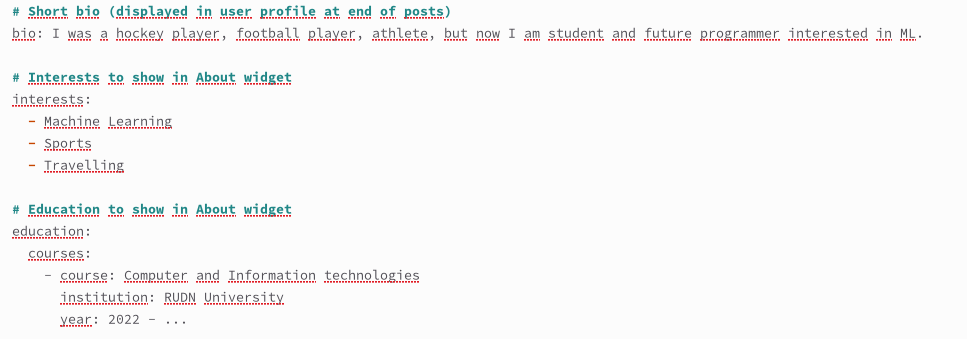
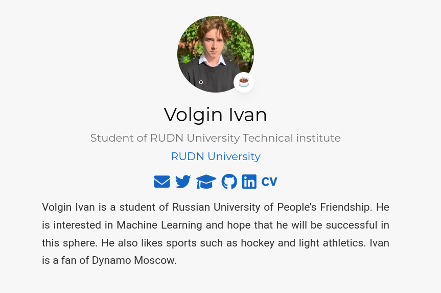
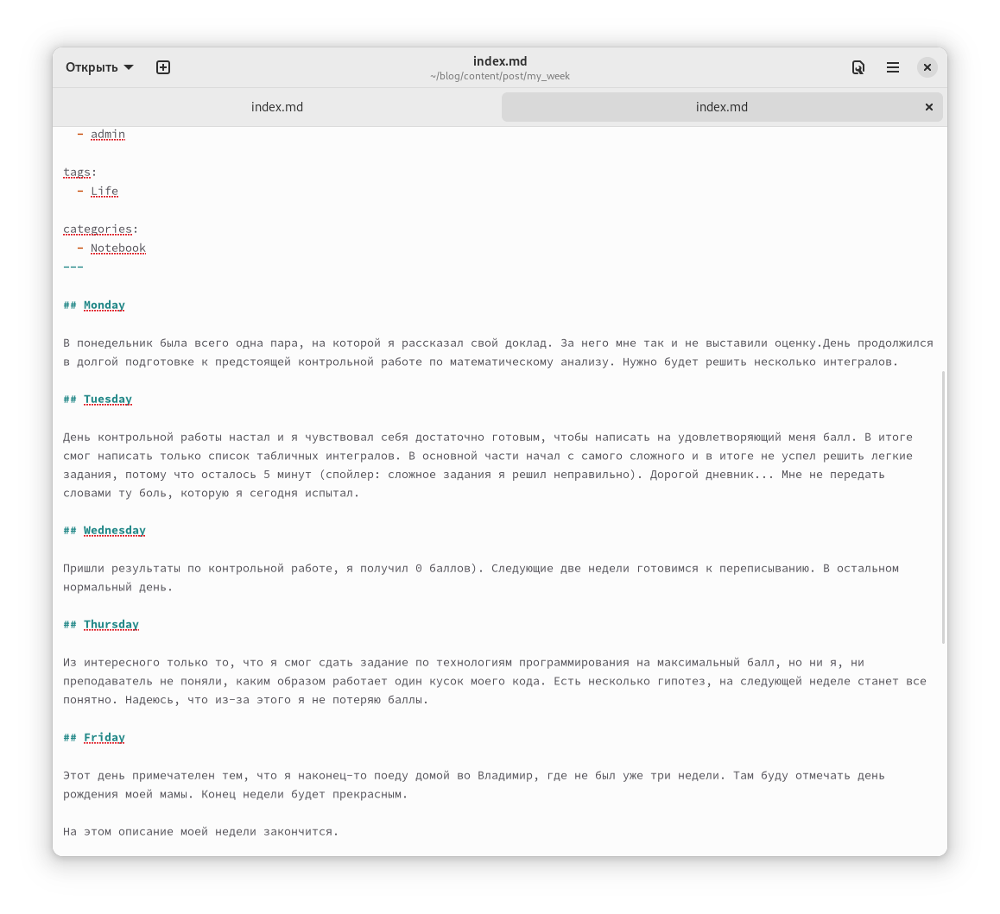
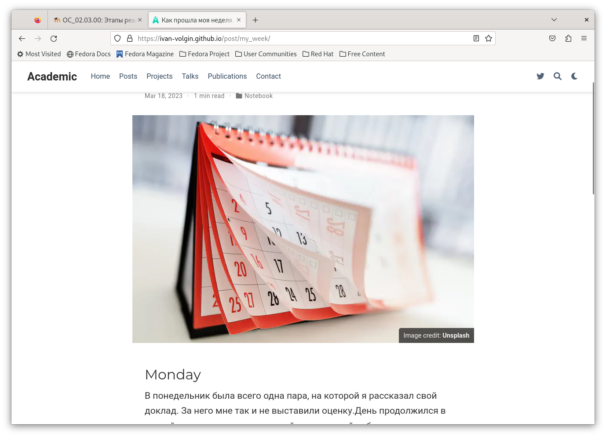
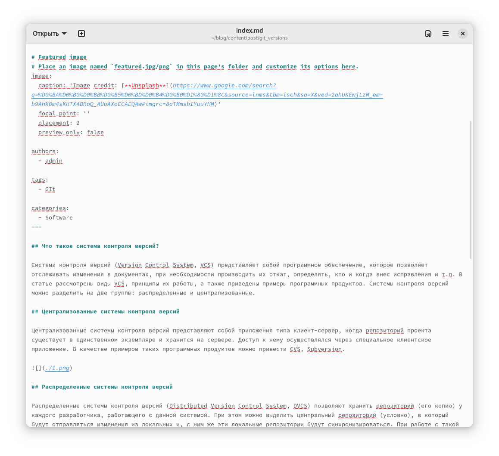
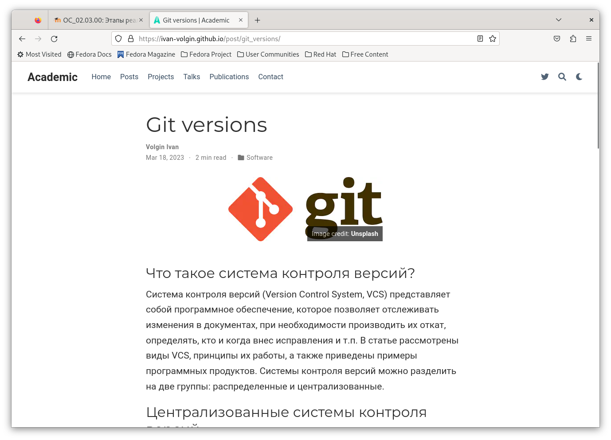

---
## Front matter
lang: ru-RU
title: Индивидуальный проект. Второй этап
subtitle: операционные системы
author:
  - Волгин И. Ф.
institute:
  - Российский университет дружбы народов, Москва, Россия
date: 18 марта 2023

## i18n babel
babel-lang: russian
babel-otherlangs: english

## Formatting pdf
toc: false
toc-title: Содержание
slide_level: 2
aspectratio: 169
section-titles: true
theme: metropolis
header-includes:
 - \metroset{progressbar=frametitle,sectionpage=progressbar,numbering=fraction}
 - '\makeatletter'
 - '\beamer@ignorenonframefalse'
 - '\makeatother'
---

## Докладчик

  * Волгин Иван Алексеевич
  * Студент по программе Компьютерные и информационные науки
  * Российский университет дружбы народов
  * <https://github.com/Ivan-Volgin>

## Сперва я добавил нужную информацию о себе.

{#fig:001 width=49%}
{#fig:002 width=49%}

## Далее нужно было создать пост про прошлую неделю

{#fig:003 width=49%}
{#fig:004 width=49%}

## Затем нужно было создать еще один пост. Тема на выбор. Я сделал про контроль версий гит.

{#fig:005 width=49%}
{#fig:006 width=49%}

## Выводы

В ходе выполнения второго этапа индивидуального проекта я научился добавлять на сайт информацию о владельце (обо мне) и создавать посты на различные темы.

:::

